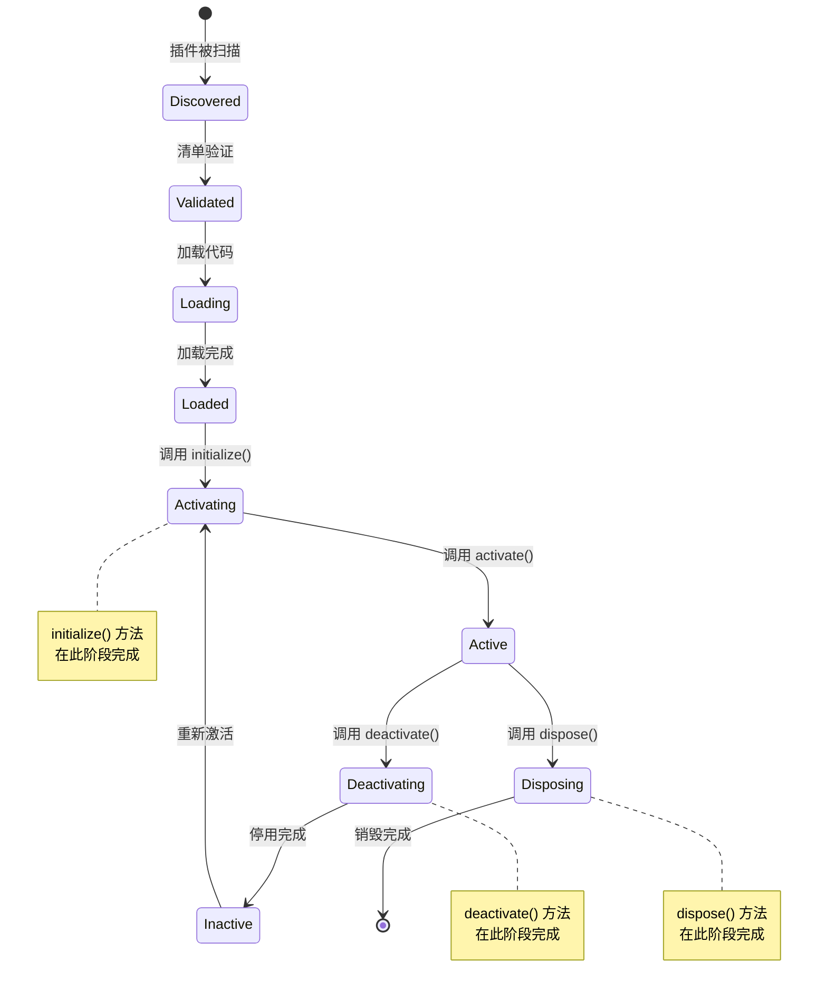
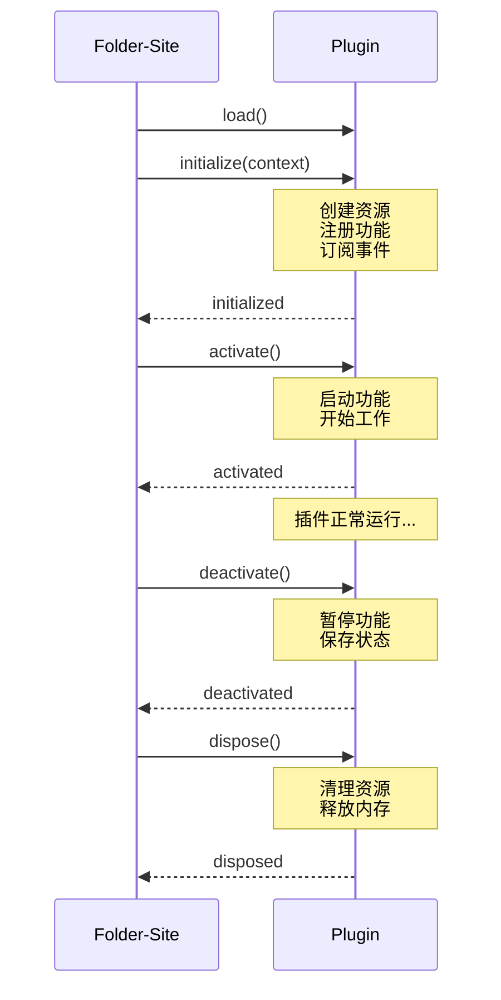
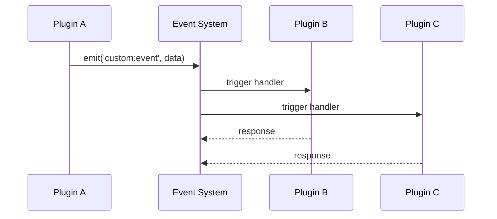

# Folder-Site 插件开发教程

> 从零开始学习如何为 Folder-Site 开发高质量插件

## 目录

- [引言](#引言)
- [快速开始](#快速开始)
- [插件基础](#插件基础)
- [API 详解](#api-详解)
- [常见插件模式](#常见插件模式)
- [进阶主题](#进阶主题)
- [调试指南](#调试指南)
- [测试指南](#测试指南)
- [发布指南](#发布指南)
- [附录](#附录)

---

## 引言

### 插件系统概述

Folder-Site 提供了一个强大且灵活的插件系统，允许开发者扩展系统功能而无需修改核心代码。插件系统具有以下核心特性：

- **类型安全**: 完整的 TypeScript 类型定义和类型检查
- **生命周期管理**: 清晰的初始化、激活、停用和销毁流程
- **事件驱动**: 基于事件的插件间通信机制
- **依赖管理**: 自动解析和管理插件依赖关系
- **资源隔离**: 插件拥有独立的存储和配置空间
- **热加载**: 支持运行时加载和卸载插件

### 为什么要开发插件

开发插件可以让你：

1. **扩展渲染能力**: 添加新的内容渲染器（如图表、公式、地图）
2. **自定义导出格式**: 支持导出为 PDF、EPUB、Word 等格式
3. **增强搜索功能**: 添加新的搜索算法或索引策略
4. **集成外部服务**: 连接第三方 API 或服务
5. **自定义 UI**: 添加自定义面板、工具栏或菜单项
6. **自动化工作流**: 实现自动化的文档处理流程

### 目标读者

本教程适合以下开发者：

- 熟悉 TypeScript 或 JavaScript 的开发者
- 了解 Node.js 运行时和模块系统
- 对文档生成、静态网站构建感兴趣的开发者
- 希望扩展 Folder-Site 功能的开发者

### 前置知识

在开始之前，你应该具备：

- TypeScript 基础知识（类型、接口、类）
- Node.js 和包管理器（npm 或 Bun）的使用经验
- 基本的异步编程理解（Promise、async/await）
- 熟悉 Markdown 语法（可选）

### 技术栈

- **语言**: TypeScript 5.6+
- **运行时**: Node.js 18+ / Bun 1.0+
- **包管理**: npm / Bun
- **构建工具**: TypeScript Compiler (tsc)

---

## 快速开始

### 最简单的插件示例（Hello World）

让我们从一个最简单的 Hello World 插件开始，这个插件在初始化时输出一条日志消息。

#### 项目结构

```
hello-world-plugin/
├── manifest.json          # 插件清单
├── package.json           # npm 配置
├── tsconfig.json          # TypeScript 配置
├── src/
│   └── index.ts           # 插件入口
└── dist/                  # 编译输出（自动生成）
```

#### 步骤 1: 创建项目

```bash
# 创建项目目录
mkdir hello-world-plugin
cd hello-world-plugin

# 初始化 npm 项目
npm init -y
```

#### 步骤 2: 配置 package.json

```json
{
  "name": "@folder-site/hello-world-plugin",
  "version": "1.0.0",
  "description": "A simple Hello World plugin",
  "main": "dist/index.js",
  "types": "dist/index.d.ts",
  "scripts": {
    "build": "tsc",
    "dev": "tsc --watch",
    "prepublishOnly": "npm run build"
  },
  "keywords": ["folder-site", "plugin"],
  "author": "Your Name",
  "license": "MIT",
  "devDependencies": {
    "typescript": "^5.6.0"
  },
  "peerDependencies": {
    "folder-site": ">=1.0.0"
  }
}
```

#### 步骤 3: 配置 TypeScript

```json
{
  "compilerOptions": {
    "target": "ES2022",
    "module": "ESNext",
    "moduleResolution": "bundler",
    "lib": ["ES2022"],
    "declaration": true,
    "declarationMap": true,
    "sourceMap": true,
    "outDir": "./dist",
    "rootDir": "./src",
    "strict": true,
    "esModuleInterop": true,
    "skipLibCheck": true,
    "forceConsistentCasingInFileNames": true
  },
  "include": ["src/**/*"],
  "exclude": ["node_modules", "dist", "tests"]
}
```

#### 步骤 4: 创建插件清单

```json
{
  "id": "hello-world",
  "name": "Hello World Plugin",
  "version": "1.0.0",
  "description": "A simple Hello World plugin",
  "author": {
    "name": "Your Name",
    "email": "your@example.com"
  },
  "license": "MIT",
  "entry": "dist/index.js",
  "capabilities": [
    {
      "type": "custom",
      "name": "hello-world",
      "version": "1.0.0"
    }
  ],
  "engines": {
    "folderSite": ">=1.0.0"
  }
}
```

#### 步骤 5: 实现插件

```typescript
// src/index.ts
import type {
  Plugin,
  PluginManifest,
  PluginContext,
  PluginStatus
} from '../../types/plugin.js';

/**
 * Hello World 插件
 * 
 * 这是一个最简单的插件示例，仅实现基本的初始化功能
 */
export class HelloWorldPlugin implements Plugin {
  // 插件元数据（只读属性）
  readonly id: string = 'hello-world';
  readonly name: string = 'Hello World Plugin';
  readonly version: string = '1.0.0';
  readonly manifest: PluginManifest;
  readonly status: PluginStatus = 'discovered';

  // 插件状态和错误
  private context?: PluginContext;

  constructor(manifest: PluginManifest) {
    this.manifest = manifest;
  }

  /**
   * 初始化插件
   * 
   * 这是插件生命周期的第一个方法，宿主环境会在加载插件后调用此方法
   * 
   * @param context - 插件上下文，提供对宿主环境的访问
   */
  async initialize(context: PluginContext): Promise<void> {
    this.context = context;

    // 输出日志
    context.logger.info('🎉 Hello World Plugin initialized!');
    context.logger.debug('Folder-Site version:', context.app.version);
    context.logger.debug('Environment:', context.app.environment);
  }

  /**
   * 激活插件
   * 
   * 插件初始化后，宿主环境会调用此方法激活插件
   */
  async activate(): Promise<void> {
    this.context?.logger.info('Hello World Plugin activated! 🚀');
  }

  /**
   * 停用插件
   * 
   * 当插件不再需要时，宿主环境会调用此方法
   */
  async deactivate(): Promise<void> {
    this.context?.logger.info('Hello World Plugin deactivated 👋');
  }

  /**
   * 销毁插件
   * 
   * 清理插件占用的所有资源
   */
  async dispose(): Promise<void> {
    this.context?.logger.info('Hello World Plugin disposed ♻️');
    this.context = undefined;
  }
}

// 默认导出插件类
export default HelloWorldPlugin;
```

#### 步骤 6: 构建插件

```bash
# 安装依赖
npm install

# 构建插件
npm run build
```

构建成功后，你会看到 `dist/` 目录下生成了编译后的文件：

```
dist/
├── index.js
├── index.d.ts
└── index.js.map
```

#### 步骤 7: 测试插件

将插件复制到你的 Folder-Site 项目的 `plugins/` 目录：

```bash
# 复制插件到 Folder-Site 项目
cp -r hello-world-plugin /path/to/folder-site/plugins/
```

然后在 Folder-Site 项目中运行：

```bash
# 启动 Folder-Site
bun run dev

# 或
npm start
```

你将在控制台输出中看到：

```
[info] 🎉 Hello World Plugin initialized!
[debug] Folder-Site version: 1.0.0
[debug] Environment: development
[info] Hello World Plugin activated! 🚀
```

### 插件生命周期可视化



---

## 插件基础

### 插件的生命周期

插件的生命周期包含以下状态和转换：

#### 状态说明

| 状态 | 说明 | 可执行的操作 |
|------|------|-------------|
| `discovered` | 插件已被扫描但未验证 | - |
| `validated` | 插件清单已验证通过 | - |
| `loading` | 正在加载插件代码 | - |
| `loaded` | 插件代码已加载，等待初始化 | - |
| `activating` | 正在调用 `initialize()` 方法 | 初始化资源 |
| `active` | 插件已激活并运行 | 执行主要功能 |
| `deactivating` | 正在调用 `deactivate()` 方法 | 暂停功能 |
| `inactive` | 插件已停用但仍加载 | - |
| `error` | 插件发生错误 | - |

#### 生命周期方法

```typescript
interface Plugin {
  // 初始化插件（必需）
  initialize(context: PluginContext): Promise<void>;

  // 激活插件（必需）
  activate(): Promise<void>;

  // 停用插件（必需）
  deactivate(): Promise<void>;

  // 销毁插件（必需）
  dispose(): Promise<void>;
}
```

#### 方法调用时机



### 插件配置文件结构

插件清单 `manifest.json` 定义了插件的所有元数据和配置。

#### 完整的清单示例

```json
{
  "id": "com.example.my-plugin",
  "name": "My Plugin",
  "version": "1.0.0",
  "description": "A comprehensive plugin example",
  "author": {
    "name": "John Doe",
    "email": "john@example.com",
    "url": "https://example.com"
  },
  "license": "MIT",
  "entry": "dist/index.js",
  "main": "dist/index.js",
  "dependencies": {
    "lodash": "^4.17.21"
  },
  "peerDependencies": {
    "folder-site": ">=1.0.0"
  },
  "capabilities": [
    {
      "type": "renderer",
      "name": "my-renderer",
      "version": "1.0.0",
      "constraints": {
        "supportedFormats": ["svg", "png"]
      }
    }
  ],
  "hooks": {
    "onLoad": "dist/hooks/onLoad.js",
    "onUnload": "dist/hooks/onUnload.js",
    "onActivate": "dist/hooks/onActivate.js",
    "onDeactivate": "dist/hooks/onDeactivate.js"
  },
  "options": {
    "type": "object",
    "properties": {
      "apiKey": {
        "type": "string",
        "description": "API key for external service"
      },
      "timeout": {
        "type": "number",
        "description": "Request timeout in milliseconds",
        "default": 5000,
        "minimum": 1000,
        "maximum": 30000
      },
      "enableCache": {
        "type": "boolean",
        "description": "Enable response caching",
        "default": true
      }
    },
    "required": ["apiKey"]
  },
  "engines": {
    "folderSite": ">=1.0.0",
    "node": ">=18.0.0"
  },
  "contributes": {
    "ui": [
      {
        "id": "my-panel",
        "type": "panel",
        "name": "MyPanel",
        "position": "right",
        "priority": 100
      }
    ],
    "commands": [
      {
        "id": "my-plugin.refresh",
        "title": "Refresh",
        "icon": "refresh",
        "keybinding": "Cmd+R"
      }
    ]
  }
}
```

#### 字段详细说明

##### 必需字段

| 字段 | 类型 | 说明 | 示例 |
|------|------|------|------|
| `id` | string | 插件唯一标识符（推荐反向域名格式） | `com.example.my-plugin` |
| `name` | string | 插件显示名称 | `My Plugin` |
| `version` | string | 语义化版本号（semver） | `1.0.0` |
| `entry` | string | 插件入口文件路径 | `dist/index.js` |
| `capabilities` | array | 插件能力声明 | 见下方 |

##### 可选字段

| 字段 | 类型 | 说明 |
|------|------|------|
| `description` | string | 插件描述 |
| `author` | object | 作者信息（name, email, url） |
| `license` | string | 许可证（SPDX 标识符） |
| `main` | string | 主模块路径（兼容旧版本） |
| `dependencies` | object | 插件依赖 |
| `peerDependencies` | object | 宿主环境依赖 |
| `hooks` | object | 生命周期钩子配置 |
| `options` | object | 插件配置项模式 |
| `engines` | object | 兼容性要求 |
| `contributes` | object | 贡献点声明 |

##### 能力类型（capabilities）

```json
{
  "capabilities": [
    {
      "type": "renderer",
      "name": "mermaid",
      "version": "1.0.0",
      "constraints": {
        "supportedFormats": ["svg", "png"],
        "supportedThemes": ["light", "dark"]
      }
    }
  ]
}
```

支持的能力类型：

- `renderer`: 内容渲染器
- `transformer`: 内容转换器
- `exporter`: 导出器
- `storage`: 存储提供者
- `ui`: UI 组件
- `custom`: 自定义能力

### 插件入口点和初始化

#### 入口点结构

插件的入口文件必须导出一个实现 `Plugin` 接口的类：

```typescript
// src/index.ts
import type { Plugin, PluginManifest, PluginContext } from '../../types/plugin.js';

export class MyPlugin implements Plugin {
  readonly id: string;
  readonly name: string;
  readonly version: string;
  readonly manifest: PluginManifest;
  private context?: PluginContext;

  constructor(manifest: PluginManifest) {
    this.id = manifest.id;
    this.name = manifest.name;
    this.version = manifest.version;
    this.manifest = manifest;
  }

  async initialize(context: PluginContext): Promise<void> {
    this.context = context;
    // 初始化逻辑
  }

  async activate(): Promise<void> {
    // 激活逻辑
  }

  async deactivate(): Promise<void> {
    // 停用逻辑
  }

  async dispose(): Promise<void> {
    // 清理逻辑
  }
}

// 默认导出插件类
export default MyPlugin;
```

#### 初始化最佳实践

```typescript
async initialize(context: PluginContext): Promise<void> {
  this.context = context;

  try {
    // 1. 记录初始化开始
    context.logger.debug('Starting initialization...');

    // 2. 获取配置
    const config = this.loadConfig(context);

    // 3. 初始化资源
    await this.initializeResources(config);

    // 4. 注册功能
    this.registerFeatures(context);

    // 5. 订阅事件
    this.setupEventListeners(context);

    // 6. 记录初始化完成
    context.logger.info('Plugin initialized successfully');
  } catch (error) {
    context.logger.error('Initialization failed:', error);
    throw error;
  }
}
```

---

## API 详解

### 核心接口和类

#### Plugin 接口

所有插件必须实现的核心接口：

```typescript
interface Plugin {
  // 只读属性
  readonly id: string;
  readonly name: string;
  readonly version: string;
  readonly manifest: PluginManifest;
  readonly status: PluginStatus;
  readonly error?: Error;

  // 生命周期方法
  initialize(context: PluginContext): Promise<void>;
  activate(): Promise<void>;
  deactivate(): Promise<void>;
  dispose(): Promise<void>;
}
```

#### PluginContext 接口

插件上下文提供对宿主环境的访问：

```typescript
interface PluginContext {
  // 宿主环境信息
  readonly app: {
    readonly version: string;
    readonly environment: 'development' | 'production';
    readonly rootPath: string;
    readonly configPath: string;
  };

  // 服务访问
  readonly services: PluginServices;

  // 事件系统
  readonly events: PluginEventEmitter;

  // 日志系统
  readonly logger: PluginLogger;

  // 插件存储
  readonly storage: PluginStorage;

  // 工具函数
  readonly utils: PluginUtils;

  // 配置
  readonly config: PluginConfig;
}
```

#### 使用示例

```typescript
async initialize(context: PluginContext): Promise<void> {
  this.context = context;

  // 访问应用信息
  console.log('Folder-Site version:', context.app.version);
  console.log('Environment:', context.app.environment);
  console.log('Root path:', context.app.rootPath);

  // 使用日志
  context.logger.debug('Debug message');
  context.logger.info('Info message');
  context.logger.warn('Warning message');
  context.logger.error('Error message', new Error('Something went wrong'));

  // 使用存储
  context.storage.set('lastRun', Date.now());
  const lastRun = context.storage.get('lastRun');

  // 使用配置
  const apiKey = context.config.get('apiKey');
  context.config.set('apiKey', 'new-key');

  // 订阅事件
  context.events.on('file:changed', (data) => {
    context.logger.info('File changed:', data.path);
  });

  // 发布事件
  context.events.emit('my-plugin:ready', { version: '1.0.0' });
}
```

### 可用的钩子（hooks）和事件

#### 生命周期钩子

插件可以在清单中声明生命周期钩子：

```json
{
  "hooks": {
    "onLoad": "dist/hooks/onLoad.js",
    "onUnload": "dist/hooks/onUnload.js",
    "onActivate": "dist/hooks/onActivate.js",
    "onDeactivate": "dist/hooks/onDeactivate.js"
  }
}
```

#### 钩子实现示例

```typescript
// src/hooks/onLoad.ts
export default async function onLoad(context: PluginContext): Promise<void> {
  context.logger.info('Plugin loaded');
  // 加载时的初始化逻辑
}
```

```typescript
// src/hooks/onUnload.ts
export default async function onUnload(context: PluginContext): Promise<void> {
  context.logger.info('Plugin unloaded');
  // 卸载时的清理逻辑
}
```

#### 系统事件

插件可以订阅以下系统事件：

| 事件名称 | 数据类型 | 说明 |
|---------|---------|------|
| `file:changed` | `{ path: string, type: 'created' \| 'updated' \| 'deleted' }` | 文件变化 |
| `file:created` | `{ path: string }` | 文件创建 |
| `file:updated` | `{ path: string }` | 文件更新 |
| `file:deleted` | `{ path: string }` | 文件删除 |
| `search:started` | `{ query: string, scope: string }` | 搜索开始 |
| `search:completed` | `{ query: string, results: number, duration: number }` | 搜索完成 |
| `render:started` | `{ path: string, format: string }` | 渲染开始 |
| `render:completed` | `{ path: string, duration: number }` | 渲染完成 |
| `export:started` | `{ paths: string[], format: string }` | 导出开始 |
| `export:completed` | `{ format: string, duration: number }` | 导出完成 |

#### 事件订阅示例

```typescript
async initialize(context: PluginContext): Promise<void> {
  this.context = context;

  // 订阅文件变化事件
  const fileWatcher = context.events.on('file:changed', (data) => {
    this.handleFileChange(data);
  });

  // 订阅搜索完成事件（一次性）
  const searchWatcher = context.events.once('search:completed', (data) => {
    this.handleSearchComplete(data);
  });

  // 订阅所有事件
  context.events.onAny((event, data) => {
    context.logger.debug(`Event received: ${event}`, data);
  });

  // 取消订阅
  fileWatcher.dispose();
  searchWatcher.dispose();
}
```

#### 发布自定义事件

```typescript
async activate(): Promise<void> {
  // 发布自定义事件
  this.context?.events.emit('my-plugin:ready', {
    version: this.version,
    capabilities: ['renderer', 'transformer']
  });

  // 带复杂数据的自定义事件
  this.context?.events.emit('my-plugin:progress', {
    current: 50,
    total: 100,
    message: 'Processing...'
  });
}
```

### 参数和返回值说明

#### initialize 方法

```typescript
initialize(context: PluginContext): Promise<void>
```

**参数**:
- `context`: 插件上下文对象

**返回值**:
- `Promise<void>`: 初始化完成后 resolve

**使用场景**:
- 初始化插件资源
- 注册渲染器、转换器等
- 订阅事件
- 加载配置

#### activate 方法

```typescript
activate(): Promise<void>
```

**参数**:
- 无

**返回值**:
- `Promise<void>`: 激活完成后 resolve

**使用场景**:
- 启动插件功能
- 开始执行任务
- 启动定时器或轮询

#### deactivate 方法

```typescript
deactivate(): Promise<void>
```

**参数**:
- 无

**返回值**:
- `Promise<void>`: 停用完成后 resolve

**使用场景**:
- 暂停插件功能
- 保存当前状态
- 停止定时器

#### dispose 方法

```typescript
dispose(): Promise<void>
```

**参数**:
- 无

**返回值**:
- `Promise<void>`: 清理完成后 resolve

**使用场景**:
- 清理所有资源
- 取消所有事件订阅
- 释放内存和文件句柄

---

## 常见插件模式

### 数据处理插件模式

数据处理插件用于处理和转换内容数据。

#### 模式特点

- 接收原始数据输入
- 执行转换或处理逻辑
- 返回处理后的数据
- 支持链式处理

#### 完整示例

```typescript
// src/DataProcessor.ts
import type { PluginContext } from '../../types/plugin.js';

/**
 * 数据处理选项
 */
export interface DataProcessorOptions {
  /** 是否启用缓存 */
  enableCache?: boolean;
  /** 缓存过期时间（毫秒） */
  cacheTTL?: number;
  /** 是否启用压缩 */
  enableCompression?: boolean;
}

/**
 * 处理结果
 */
export interface ProcessResult<T> {
  /** 处理后的数据 */
  data: T;
  /** 是否来自缓存 */
  cached: boolean;
  /** 处理耗时（毫秒） */
  duration: number;
  /** 处理大小（字节） */
  size: number;
}

/**
 * 数据处理器基类
 */
export abstract class DataProcessor<TInput, TOutput> {
  protected context: PluginContext;
  protected cache: Map<string, { data: TOutput; timestamp: number }>;
  protected options: DataProcessorOptions;

  constructor(context: PluginContext, options?: DataProcessorOptions) {
    this.context = context;
    this.options = {
      enableCache: true,
      cacheTTL: 5 * 60 * 1000, // 5 分钟
      enableCompression: false,
      ...options
    };
    this.cache = new Map();
  }

  /**
   * 抽象方法：处理数据
   */
  protected abstract process(input: TInput): Promise<TOutput>;

  /**
   * 生成缓存键
   */
  protected getCacheKey(input: TInput): string {
    return JSON.stringify(input);
  }

  /**
   * 处理数据（带缓存）
   */
  async handle(input: TInput): Promise<ProcessResult<TOutput>> {
    const startTime = Date.now();
    const cacheKey = this.getCacheKey(input);

    // 检查缓存
    if (this.options.enableCache) {
      const cached = this.cache.get(cacheKey);
      if (cached && Date.now() - cached.timestamp < this.options.cacheTTL!) {
        const size = JSON.stringify(cached.data).length;
        return {
          data: cached.data,
          cached: true,
          duration: Date.now() - startTime,
          size
        };
      }
    }

    // 处理数据
    const data = await this.process(input);

    // 更新缓存
    if (this.options.enableCache) {
      this.cache.set(cacheKey, {
        data,
        timestamp: Date.now()
      });
    }

    const size = JSON.stringify(data).length;
    return {
      data,
      cached: false,
      duration: Date.now() - startTime,
      size
    };
  }

  /**
   * 清理缓存
   */
  clearCache(): void {
    this.cache.clear();
  }

  /**
   * 清理过期缓存
   */
  cleanExpiredCache(): void {
    const now = Date.now();
    for (const [key, value] of this.cache.entries()) {
      if (now - value.timestamp > this.options.cacheTTL!) {
        this.cache.delete(key);
      }
    }
  }

  /**
   * 获取缓存统计
   */
  getCacheStats(): {
    size: number;
    hitRate: number;
  } {
    return {
      size: this.cache.size,
      hitRate: 0 // 需要跟踪命中次数
    };
  }

  /**
   * 销毁处理器
   */
  dispose(): void {
    this.clearCache();
  }
}

/**
 * Markdown 数据处理器示例
 */
export class MarkdownProcessor extends DataProcessor<string, string> {
  constructor(context: PluginContext, options?: DataProcessorOptions) {
    super(context, options);
  }

  protected async process(markdown: string): Promise<string> {
    this.context.logger.debug('Processing markdown...');

    // 示例：简单的 Markdown 处理
    let html = markdown
      // 转换标题
      .replace(/^# (.*$)/gim, '<h1>$1</h1>')
      .replace(/^## (.*$)/gim, '<h2>$1</h2>')
      .replace(/^### (.*$)/gim, '<h3>$1</h3>')
      // 转换粗体
      .replace(/\*\*(.*)\*\*/gim, '<strong>$1</strong>')
      // 转换斜体
      .replace(/\*(.*)\*/gim, '<em>$1</em>')
      // 转换代码块
      .replace(/```(\w+)?\n([\s\S]*?)\n```/gim, '<pre><code class="language-$1">$2</code></pre>')
      // 转换行内代码
      .replace(/`([^`]+)`/gim, '<code>$1</code>')
      // 转换链接
      .replace(/\[([^\]]+)\]\(([^)]+)\)/gim, '<a href="$2">$1</a>');

    this.context.logger.info('Markdown processed successfully');
    return html;
  }
}
```

#### 使用示例

```typescript
// src/index.ts
import type { Plugin, PluginContext, PluginManifest } from '../../types/plugin.js';
import { MarkdownProcessor } from './DataProcessor.js';

export class DataProcessingPlugin implements Plugin {
  readonly id = 'data-processor';
  readonly name = 'Data Processing Plugin';
  readonly version = '1.0.0';
  readonly manifest: PluginManifest;
  private context?: PluginContext;
  private processor?: MarkdownProcessor;

  constructor(manifest: PluginManifest) {
    this.manifest = manifest;
  }

  async initialize(context: PluginContext): Promise<void> {
    this.context = context;
    this.processor = new MarkdownProcessor(context, {
      enableCache: true,
      cacheTTL: 10 * 60 * 1000
    });

    context.logger.info('Data Processing Plugin initialized');
  }

  async activate(): Promise<void> {
    // 示例：处理 Markdown
    const markdown = `# Hello World

This is a **test** paragraph with *italic* text.

\`\`\`javascript
console.log('Hello');
\`\`\`
`;

    const result = await this.processor?.handle(markdown);
    this.context?.logger.info('Processing result:', result);
  }

  async deactivate(): Promise<void> {
    this.processor?.dispose();
  }

  async dispose(): Promise<void> {
    this.processor?.dispose();
  }
}

export default DataProcessingPlugin;
```

### UI 扩展插件模式

UI 扩展插件用于添加自定义 UI 组件和界面元素。

#### 模式特点

- 贡献 UI 组件
- 自定义面板和工具栏
- 添加菜单项和命令
- 集成到现有界面

#### 完整示例

```typescript
// src/UIExtension.ts
import type { PluginContext } from '../../types/plugin.js';

/**
 * UI 组件配置
 */
export interface UIComponentConfig {
  /** 组件 ID */
  id: string;
  /** 组件类型 */
  type: 'panel' | 'modal' | 'toolbar' | 'menu';
  /** 组件标题 */
  title: string;
  /** 显示位置 */
  position?: 'left' | 'right' | 'top' | 'bottom' | 'center';
  /** 优先级 */
  priority?: number;
  /** 图标 */
  icon?: string;
  /** 快捷键 */
  keybinding?: string;
}

/**
 * UI 扩展基类
 */
export abstract class UIExtension {
  protected context: PluginContext;
  protected components: Map<string, UIComponentConfig>;

  constructor(context: PluginContext) {
    this.context = context;
    this.components = new Map();
  }

  /**
   * 抽象方法：渲染组件
   */
  protected abstract renderComponent(config: UIComponentConfig): string;

  /**
   * 注册组件
   */
  registerComponent(config: UIComponentConfig): void {
    this.components.set(config.id, config);
    this.context.logger.info(`UI component registered: ${config.id}`);

    // 发布组件注册事件
    this.context.events.emit('ui:component:registered', config);
  }

  /**
   * 注销组件
   */
  unregisterComponent(id: string): void {
    this.components.delete(id);
    this.context.logger.info(`UI component unregistered: ${id}`);

    // 发布组件注销事件
    this.context.events.emit('ui:component:unregistered', { id });
  }

  /**
   * 获取组件配置
   */
  getComponent(id: string): UIComponentConfig | undefined {
    return this.components.get(id);
  }

  /**
   * 获取所有组件
   */
  getAllComponents(): UIComponentConfig[] {
    return Array.from(this.components.values());
  }

  /**
   * 渲染组件
   */
  render(id: string): string | undefined {
    const config = this.getComponent(id);
    if (!config) {
      this.context.logger.warn(`Component not found: ${id}`);
      return undefined;
    }

    return this.renderComponent(config);
  }

  /**
   * 销毁扩展
   */
  dispose(): void {
    this.components.clear();
  }
}

/**
 * 自定义面板扩展示例
 */
export class CustomPanelExtension extends UIExtension {
  protected renderComponent(config: UIComponentConfig): string {
    if (config.type !== 'panel') {
      throw new Error('This extension only supports panel components');
    }

    return `
      <div class="custom-panel" id="${config.id}">
        <div class="panel-header">
          <h3>${config.title}</h3>
          ${config.icon ? `<span class="icon">${config.icon}</span>` : ''}
        </div>
        <div class="panel-content">
          ${this.renderPanelContent(config.id)}
        </div>
      </div>
    `;
  }

  private renderPanelContent(id: string): string {
    // 根据面板 ID 渲染不同的内容
    switch (id) {
      case 'info-panel':
        return `
          <div class="info-content">
            <p>Fold-Site version: ${this.context.app.version}</p>
            <p>Environment: ${this.context.app.environment}</p>
            <p>Plugins loaded: ${this.getPluginCount()}</p>
          </div>
        `;
      case 'stats-panel':
        return `
          <div class="stats-content">
            <div class="stat-item">
              <span class="stat-label">Files</span>
              <span class="stat-value">0</span>
            </div>
          </div>
        `;
      default:
        return '<p>No content available</p>';
    }
  }

  private getPluginCount(): number {
    // 模拟获取插件数量
    return 1;
  }
}
```

#### 使用示例

```typescript
// src/index.ts
import type { Plugin, PluginContext, PluginManifest } from '../../types/plugin.js';
import { CustomPanelExtension } from './UIExtension.js';

export class UIExtensionPlugin implements Plugin {
  readonly id = 'ui-extension';
  readonly name = 'UI Extension Plugin';
  readonly version = '1.0.0';
  readonly manifest: PluginManifest;
  private context?: PluginContext;
  private extension?: CustomPanelExtension;

  constructor(manifest: PluginManifest) {
    this.manifest = manifest;
  }

  async initialize(context: PluginContext): Promise<void> {
    this.context = context;
    this.extension = new CustomPanelExtension(context);

    // 注册信息面板
    this.extension.registerComponent({
      id: 'info-panel',
      type: 'panel',
      title: 'Information',
      position: 'right',
      priority: 100,
      icon: 'ℹ️'
    });

    // 注册统计面板
    this.extension.registerComponent({
      id: 'stats-panel',
      type: 'panel',
      title: 'Statistics',
      position: 'right',
      priority: 90,
      icon: '📊'
    });

    context.logger.info('UI Extension Plugin initialized');
  }

  async activate(): Promise<void> {
    // 渲染面板
    const infoPanel = this.extension?.render('info-panel');
    const statsPanel = this.extension?.render('stats-panel');

    this.context?.logger.info('Panels rendered');
  }

  async deactivate(): Promise<void> {
    this.extension?.dispose();
  }

  async dispose(): Promise<void> {
    this.extension?.dispose();
  }
}

export default UIExtensionPlugin;
```

### 事件监听插件模式

事件监听插件通过监听系统事件来扩展功能。

#### 模式特点

- 监听系统事件
- 响应事件触发操作
- 支持事件过滤和转换
- 可发布自定义事件

#### 完整示例

```typescript
// src/EventListener.ts
import type { PluginContext, Disposable } from '../../types/plugin.js';

/**
 * 事件处理器类型
 */
export type EventHandler<T = unknown> = (data: T) => void | Promise<void>;

/**
 * 事件监听器配置
 */
export interface EventListenerConfig {
  /** 事件名称 */
  event: string;
  /** 处理器 */
  handler: EventHandler;
  /** 是否只执行一次 */
  once?: boolean;
  /** 优先级 */
  priority?: number;
}

/**
 * 事件监听器管理器
 */
export class EventListenerManager {
  private context: PluginContext;
  private listeners: Map<string, Disposable[]>;
  private filter?: (event: string, data: unknown) => boolean;

  constructor(context: PluginContext) {
    this.context = context;
    this.listeners = new Map();
  }

  /**
   * 设置事件过滤器
   */
  setFilter(filter: (event: string, data: unknown) => boolean): void {
    this.filter = filter;
  }

  /**
   * 监听事件
   */
  on<T = unknown>(event: string, handler: EventHandler<T>): void {
    const wrappedHandler = (data: T) => {
      // 应用过滤器
      if (this.filter && !this.filter(event, data)) {
        return;
      }

      // 执行处理器
      try {
        const result = handler(data);
        if (result instanceof Promise) {
          result.catch(error => {
            this.context.logger.error(`Event handler error for ${event}:`, error);
          });
        }
      } catch (error) {
        this.context.logger.error(`Event handler error for ${event}:`, error);
      }
    };

    const disposable = this.context.events.on(event, wrappedHandler);

    if (!this.listeners.has(event)) {
      this.listeners.set(event, []);
    }
    this.listeners.get(event)!.push(disposable);

    this.context.logger.debug(`Event listener registered: ${event}`);
  }

  /**
   * 监听事件（一次性）
   */
  once<T = unknown>(event: string, handler: EventHandler<T>): void {
    const disposable = this.context.events.once(event, (data: T) => {
      // 移除监听器
      const listeners = this.listeners.get(event);
      if (listeners) {
        const index = listeners.indexOf(disposable);
        if (index > -1) {
          listeners.splice(index, 1);
        }
      }

      // 执行处理器
      handler(data);
    });

    if (!this.listeners.has(event)) {
      this.listeners.set(event, []);
    }
    this.listeners.get(event)!.push(disposable);

    this.context.logger.debug(`One-time event listener registered: ${event}`);
  }

  /**
   * 取消所有事件监听
   */
  off(event?: string): void {
    if (event) {
      // 取消指定事件的所有监听器
      const listeners = this.listeners.get(event);
      if (listeners) {
        listeners.forEach(disposable => disposable.dispose());
        this.listeners.delete(event);
        this.context.logger.debug(`All listeners removed for event: ${event}`);
      }
    } else {
      // 取消所有事件监听器
      for (const [evt, disposables] of this.listeners.entries()) {
        disposables.forEach(disposable => disposable.dispose());
      }
      this.listeners.clear();
      this.context.logger.debug('All event listeners removed');
    }
  }

  /**
   * 获取监听器数量
   */
  getListenerCount(event?: string): number {
    if (event) {
      return this.listeners.get(event)?.length || 0;
    }
    return Array.from(this.listeners.values()).reduce((sum, arr) => sum + arr.length, 0);
  }

  /**
   * 销毁管理器
   */
  dispose(): void {
    this.off();
  }
}

/**
 * 文件监听器示例
 */
export class FileWatcher {
  private manager: EventListenerManager;
  private fileChanges: Map<string, number>;

  constructor(context: PluginContext) {
    this.manager = new EventListenerManager(context);
    this.fileChanges = new Map();
  }

  /**
   * 启动文件监听
   */
  start(): void {
    // 监听文件变化
    this.manager.on<{ path: string; type: string }>('file:changed', (data) => {
      this.handleFileChange(data);
    });

    // 监听文件创建
    this.manager.on<{ path: string }>('file:created', (data) => {
      this.context.logger.info('File created:', data.path);
    });

    // 监听文件删除
    this.manager.on<{ path: string }>('file:deleted', (data) => {
      this.context.logger.info('File deleted:', data.path);
      this.fileChanges.delete(data.path);
    });
  }

  private handleFileChange(data: { path: string; type: string }): void {
    const now = Date.now();
    this.fileChanges.set(data.path, now);

    this.context.logger.info(`File ${data.type}:`, data.path);

    // 检查是否频繁变化
    const lastChange = this.fileChanges.get(data.path) || 0;
    if (now - lastChange < 1000) {
      this.context.logger.warn('File changing frequently:', data.path);
    }
  }

  /**
   * 停止文件监听
   */
  stop(): void {
    this.manager.dispose();
  }

  /**
   * 获取文件变化统计
   */
  getStats(): {
    totalChanges: number;
    filesChanged: number;
  } {
    return {
      totalChanges: Array.from(this.fileChanges.values()).length,
      filesChanged: this.fileChanges.size
    };
  }

  private get context(): PluginContext {
    return (this.manager as any).context;
  }
}
```

#### 使用示例

```typescript
// src/index.ts
import type { Plugin, PluginContext, PluginManifest } from '../../types/plugin.js';
import { FileWatcher } from './EventListener.js';

export class EventListenerPlugin implements Plugin {
  readonly id = 'event-listener';
  readonly name = 'Event Listener Plugin';
  readonly version = '1.0.0';
  readonly manifest: PluginManifest;
  private context?: PluginContext;
  private fileWatcher?: FileWatcher;

  constructor(manifest: PluginManifest) {
    this.manifest = manifest;
  }

  async initialize(context: PluginContext): Promise<void> {
    this.context = context;
    this.fileWatcher = new FileWatcher(context);

    context.logger.info('Event Listener Plugin initialized');
  }

  async activate(): Promise<void> {
    // 启动文件监听
    this.fileWatcher?.start();

    this.context?.logger.info('Event Listener Plugin activated');
  }

  async deactivate(): Promise<void> {
    // 停止文件监听
    this.fileWatcher?.stop();

    this.context?.logger.info('Event Listener Plugin deactivated');
  }

  async dispose(): Promise<void> {
    this.fileWatcher?.stop();
  }
}

export default EventListenerPlugin;
```

### 中间件插件模式

中间件插件用于拦截和处理请求/响应。

#### 模式特点

- 拦截请求和响应
- 修改数据
- 添加验证和授权
- 支持链式处理

#### 完整示例

```typescript
// src/Middleware.ts
import type { PluginContext } from '../../types/plugin.js';

/**
 * 中间件上下文
 */
export interface MiddlewareContext<T = unknown> {
  /** 请求数据 */
  request: T;
  /** 响应数据 */
  response?: unknown;
  /** 元数据 */
  metadata: Record<string, unknown>;
  /** 是否已终止 */
  terminated: boolean;
}

/**
 * 中间件处理器
 */
export type MiddlewareHandler<T = unknown> = (
  ctx: MiddlewareContext<T>,
  next: () => Promise<void>
) => Promise<void>;

/**
 * 中间件插件
 */
export class MiddlewarePlugin<T = unknown> {
  private context: PluginContext;
  private middlewares: MiddlewareHandler<T>[];

  constructor(context: PluginContext) {
    this.context = context;
    this.middlewares = [];
  }

  /**
   * 添加中间件
   */
  use(handler: MiddlewareHandler<T>): void {
    this.middlewares.push(handler);
    this.context.logger.debug('Middleware added');
  }

  /**
   * 执行中间件链
   */
  async execute(request: T): Promise<MiddlewareContext<T>> {
    const ctx: MiddlewareContext<T> = {
      request,
      metadata: {},
      terminated: false
    };

    let index = 0;

    const next = async (): Promise<void> => {
      if (ctx.terminated || index >= this.middlewares.length) {
        return;
      }

      const handler = this.middlewares[index++];
      await handler(ctx, next);
    };

    try {
      await next();
    } catch (error) {
      this.context.logger.error('Middleware execution error:', error);
      ctx.metadata.error = error;
    }

    return ctx;
  }

  /**
   * 清除所有中间件
   */
  clear(): void {
    this.middlewares = [];
  }

  /**
   * 获取中间件数量
   */
  get size(): number {
    return this.middlewares.length;
  }
}

/**
 * 日志中间件
 */
export function createLoggingMiddleware<T>(context: PluginContext): MiddlewareHandler<T> {
  return async (ctx, next) => {
    const startTime = Date.now();

    context.logger.debug('Request started:', ctx.request);

    await next();

    const duration = Date.now() - startTime;
    context.logger.debug(`Request completed in ${duration}ms`);
  };
}

/**
 * 验证中间件
 */
export function createValidationMiddleware<T>(
  validator: (data: T) => boolean,
  context: PluginContext
): MiddlewareHandler<T> {
  return async (ctx, next) => {
    if (!validator(ctx.request)) {
      ctx.terminated = true;
      ctx.metadata.error = 'Validation failed';
      context.logger.warn('Request validation failed');
      return;
    }

    await next();
  };
}

/**
 * 转换中间件
 */
export function createTransformMiddleware<TIn, TOut>(
  transformer: (data: TIn) => TOut,
  context: PluginContext
): MiddlewareHandler<TIn> {
  return async (ctx, next) => {
    const transformed = transformer(ctx.request);
    ctx.metadata.transformed = transformed;

    await next();
  };
}
```

#### 使用示例

```typescript
// src/index.ts
import type { Plugin, PluginContext, PluginManifest } from '../../types/plugin.js';
import {
  MiddlewarePlugin,
  createLoggingMiddleware,
  createValidationMiddleware,
  createTransformMiddleware
} from './Middleware.js';

interface RenderRequest {
  content: string;
  format: string;
  options?: Record<string, unknown>;
}

export class MiddlewarePluginExample implements Plugin {
  readonly id = 'middleware-plugin';
  readonly name = 'Middleware Plugin';
  readonly version = '1.0.0';
  readonly manifest: PluginManifest;
  private context?: PluginContext;
  private middleware?: MiddlewarePlugin<RenderRequest>;

  constructor(manifest: PluginManifest) {
    this.manifest = manifest;
  }

  async initialize(context: PluginContext): Promise<void> {
    this.context = context;
    this.middleware = new MiddlewarePlugin<RenderRequest>(context);

    // 添加日志中间件
    this.middleware.use(createLoggingMiddleware(context));

    // 添加验证中间件
    this.middleware.use(createValidationMiddleware(
      (req) => !!req.content && !!req.format,
      context
    ));

    // 添加转换中间件
    this.middleware.use(createTransformMiddleware(
      (req) => ({
        ...req,
        content: req.content.trim(),
        format: req.format.toLowerCase()
      }),
      context
    ));

    context.logger.info('Middleware Plugin initialized');
  }

  async activate(): Promise<void> {
    // 执行中间件链
    const result = await this.middleware?.execute({
      content: '  Hello World  ',
      format: 'HTML',
      options: { highlight: true }
    });

    this.context?.logger.info('Middleware result:', result);
  }

  async deactivate(): Promise<void> {
    this.middleware?.clear();
  }

  async dispose(): Promise<void> {
    this.middleware?.clear();
  }
}

export default MiddlewarePluginExample;
```

---

## 进阶主题

### 插件间通信

插件之间可以通过事件系统进行通信。

#### 通信模式



#### 发布-订阅模式

```typescript
// 插件 A：发布事件
class PublisherPlugin implements Plugin {
  async activate(): Promise<void> {
    // 发布自定义事件
    this.context?.events.emit('my-plugin:data-updated', {
      source: 'publisher',
      timestamp: Date.now(),
      data: { message: 'Hello from Publisher' }
    });
  }
}

// 插件 B：订阅事件
class SubscriberPlugin implements Plugin {
  private disposables: Disposable[] = [];

  async initialize(context: PluginContext): Promise<void> {
    // 订阅事件
    const disposable = context.events.on('my-plugin:data-updated', (data) => {
      context.logger.info('Data updated:', data);
      this.handleDataUpdate(data);
    });
    this.disposables.push(disposable);
  }

  async deactivate(): Promise<void> {
    // 取消所有订阅
    this.disposables.forEach(d => d.dispose());
    this.disposables = [];
  }

  private handleDataUpdate(data: any): void {
    // 处理数据更新
  }
}
```

#### 请求-响应模式

```typescript
// 插件 A：发送请求
class RequesterPlugin implements Plugin {
  async activate(): Promise<void> {
    // 发送请求并等待响应
    const requestId = `request-${Date.now()}`;

    // 订阅响应
    const responseDisposable = this.context?.events.on(
      `response:${requestId}`,
      (data) => {
        this.context?.logger.info('Response received:', data);
        responseDisposable?.dispose();
      }
    );

    // 发送请求
    this.context?.events.emit('my-plugin:request', {
      requestId,
      action: 'get-data',
      params: { id: 123 }
    });
  }
}

// 插件 B：处理请求
class ResponderPlugin implements Plugin {
  async initialize(context: PluginContext): Promise<void> {
    // 监听请求
    context.events.on('my-plugin:request', async (data: any) => {
      // 处理请求
      const result = await this.handleRequest(data);

      // 发送响应
      context.events.emit(`response:${data.requestId}`, {
        success: true,
        data: result
      });
    });
  }

  private async handleRequest(data: any): Promise<any> {
    // 处理业务逻辑
    return { message: 'Response data' };
  }
}
```

### 依赖管理

插件可以声明依赖关系，系统会自动解析和加载依赖。

#### 声明依赖

```json
{
  "id": "plugin-a",
  "dependencies": {
    "plugin-b": ">=1.0.0",
    "plugin-c": "^2.0.0"
  },
  "peerDependencies": {
    "folder-site": ">=1.0.0"
  }
}
```

#### 检查依赖

```typescript
async initialize(context: PluginContext): Promise<void> {
  // 检查依赖插件是否已加载
  const pluginB = context.services.pluginRegistry?.get('plugin-b');

  if (!pluginB) {
    throw new Error('Required plugin "plugin-b" not found');
  }

  // 访问依赖插件的功能
  const renderer = context.services.renderService?.getRenderer('plugin-b-renderer');
}
```

#### 依赖注入

```typescript
class PluginA implements Plugin {
  private pluginB?: Plugin;
  private pluginC?: Plugin;

  async initialize(context: PluginContext): Promise<void> {
    // 注入依赖插件
    this.pluginB = context.services.pluginRegistry?.get('plugin-b');
    this.pluginC = context.services.pluginRegistry?.get('plugin-c');

    // 验证依赖
    if (!this.pluginB || !this.pluginC) {
      throw new Error('Required dependencies not available');
    }

    // 使用依赖插件
    this.usePluginB();
  }

  private usePluginB(): void {
    // 调用插件 B 的功能
    if (this.pluginB && 'getData' in this.pluginB) {
      // @ts-ignore
      const data = this.pluginB.getData();
    }
  }
}
```

### 插件配置和选项

插件可以定义配置选项，用户可以通过配置文件进行自定义。

#### 定义配置模式

```json
{
  "options": {
    "type": "object",
    "properties": {
      "apiKey": {
        "type": "string",
        "description": "API key for external service"
      },
      "timeout": {
        "type": "number",
        "description": "Request timeout in milliseconds",
        "default": 5000,
        "minimum": 1000,
        "maximum": 30000
      },
      "enableCache": {
        "type": "boolean",
        "description": "Enable response caching",
        "default": true
      },
      "theme": {
        "type": "string",
        "description": "UI theme",
        "enum": ["light", "dark", "auto"],
        "default": "auto"
      }
    },
    "required": ["apiKey"]
  }
}
```

#### 使用配置

```typescript
async initialize(context: PluginContext): Promise<void> {
  // 获取配置值
  const apiKey = context.config.get('apiKey');
  const timeout = context.config.get('timeout', 5000);
  const enableCache = context.config.get('enableCache', true);
  const theme = context.config.get('theme', 'auto');

  // 验证必需配置
  if (!apiKey) {
    throw new Error('API key is required. Please configure it in your settings.');
  }

  // 使用配置
  this.initializeWithConfig({
    apiKey,
    timeout,
    enableCache,
    theme
  });
}

async initializeWithConfig(config: {
  apiKey: string;
  timeout: number;
  enableCache: boolean;
  theme: string;
}): void {
  // 使用配置初始化
}
```

#### 监听配置变化

```typescript
async initialize(context: PluginContext): Promise<void> {
  // 监听配置变化
  const disposable = context.config.onChange('apiKey', (newValue) => {
    this.context?.logger.info('API key changed:', newValue);
    this.reinitializeWithApiKey(newValue);
  });

  // 保存 disposable 以便清理
  this.configDisposables.push(disposable);
}

async deactivate(): Promise<void> {
  // 清理配置监听器
  this.configDisposables.forEach(d => d.dispose());
  this.configDisposables = [];
}
```

### 性能优化技巧

#### 使用缓存

```typescript
class CachedRenderer {
  private cache: Map<string, { result: string; timestamp: number }>;
  private cacheTTL: number = 5 * 60 * 1000; // 5 分钟

  async render(content: string): Promise<string> {
    const cacheKey = this.getCacheKey(content);

    // 检查缓存
    const cached = this.cache.get(cacheKey);
    if (cached && Date.now() - cached.timestamp < this.cacheTTL) {
      return cached.result;
    }

    // 渲染内容
    const result = await this.doRender(content);

    // 更新缓存
    this.cache.set(cacheKey, {
      result,
      timestamp: Date.now()
    });

    return result;
  }

  private getCacheKey(content: string): string {
    // 生成缓存键（可以使用哈希）
    return content;
  }

  private async doRender(content: string): Promise<string> {
    // 实际渲染逻辑
    return content;
  }

  clearCache(): void {
    this.cache.clear();
  }
}
```

#### 使用防抖和节流

```typescript
class OptimizedProcessor {
  private debouncedUpdate: (path: string) => void;
  private throttledProcess: (data: any) => void;

  constructor(context: PluginContext) {
    // 使用防抖（延迟执行）
    this.debouncedUpdate = context.utils.debounce((path: string) => {
      this.updateFile(path);
    }, 300);

    // 使用节流（限制执行频率）
    this.throttledProcess = context.utils.throttle((data: any) => {
      this.processData(data);
    }, 1000);
  }

  handleFileChange(path: string): void {
    // 防抖：文件变化后 300ms 执行一次
    this.debouncedUpdate(path);
  }

  handleDataUpdate(data: any): void {
    // 节流：最多每秒执行一次
    this.throttledProcess(data);
  }

  private updateFile(path: string): void {
    // 更新文件
  }

  private processData(data: any): void {
    // 处理数据
  }
}
```

#### 使用 Worker 处理密集任务

```typescript
class WorkerProcessor {
  private worker?: Worker;

  async initialize(): Promise<void> {
    // 创建 Worker
    this.worker = new Worker('./worker.js', {
      type: 'module'
    });

    // 监听 Worker 消息
    this.worker.on('message', (result) => {
      this.handleWorkerResult(result);
    });

    // 监听 Worker 错误
    this.worker.on('error', (error) => {
      this.context?.logger.error('Worker error:', error);
    });
  }

  async process(data: any): Promise<any> {
    return new Promise((resolve, reject) => {
      if (!this.worker) {
        reject(new Error('Worker not initialized'));
        return;
      }

      // 发送数据到 Worker
      this.worker.postMessage(data);

      // 设置超时
      const timeout = setTimeout(() => {
        reject(new Error('Worker timeout'));
      }, 30000);

      // 监听响应
      const handler = (result: any) => {
        clearTimeout(timeout);
        resolve(result);
      };

      this.worker.once('message', handler);
    });
  }

  private handleWorkerResult(result: any): void {
    // 处理 Worker 结果
  }

  async dispose(): Promise<void> {
    this.worker?.terminate();
    this.worker = undefined;
  }
}
```

#### 批量处理

```typescript
class BatchProcessor {
  private queue: any[] = [];
  private batchSize: number = 100;
  private flushInterval: number = 1000;
  private timer?: NodeJS.Timeout;

  async initialize(): Promise<void> {
    // 定期刷新队列
    this.timer = setInterval(() => {
      this.flush();
    }, this.flushInterval);
  }

  add(item: any): void {
    this.queue.push(item);

    // 达到批量大小，立即刷新
    if (this.queue.length >= this.batchSize) {
      this.flush();
    }
  }

  private flush(): void {
    if (this.queue.length === 0) {
      return;
    }

    const batch = this.queue.splice(0, this.batchSize);
    this.processBatch(batch);
  }

  private async processBatch(batch: any[]): Promise<void> {
    // 批量处理
    this.context?.logger.info(`Processing batch of ${batch.length} items`);

    // 并行处理
    const results = await Promise.all(
      batch.map(item => this.processItem(item))
    );

    // 处理结果
    this.handleResults(results);
  }

  private async processItem(item: any): Promise<any> {
    // 处理单个项目
    return item;
  }

  private handleResults(results: any[]): void {
    // 处理批量结果
  }

  async dispose(): Promise<void> {
    // 刷新剩余项目
    this.flush();

    // 清理定时器
    if (this.timer) {
      clearInterval(this.timer);
      this.timer = undefined;
    }
  }
}
```

---

## 调试指南

### 本地开发环境设置

#### 项目结构

```
my-plugin/
├── src/
│   ├── index.ts           # 插件主入口
│   ├── renderer.ts        # 渲染器实现
│   └── utils.ts           # 工具函数
├── tests/
│   └── plugin.test.ts     # 插件测试
├── dist/                  # 编译输出
├── package.json
├── tsconfig.json
├── manifest.json
└── .folder-siterc.json    # 本地配置
```

#### 配置文件

`.folder-siterc.json`

```json
{
  "plugins": ["./"],
  "logLevel": "debug",
  "watch": true,
  "hotReload": true
}
```

#### 开发脚本

`package.json`

```json
{
  "scripts": {
    "build": "tsc",
    "dev": "tsc --watch",
    "test": "bun test",
    "lint": "eslint src --ext .ts",
    "typecheck": "tsc --noEmit",
    "clean": "rm -rf dist"
  }
}
```

### 调试工具和技巧

#### 使用日志

```typescript
async initialize(context: PluginContext): Promise<void> {
  // 调试日志：详细的调试信息
  context.logger.debug('Initializing plugin with config:', {
    id: this.id,
    version: this.version,
    manifest: this.manifest
  });

  // 信息日志：一般信息
  context.logger.info('Plugin initialized successfully');

  // 警告日志：潜在问题
  context.logger.warn('API key not configured, using fallback');

  // 错误日志：错误信息
  context.logger.error('Failed to initialize plugin', error);
}
```

#### 使用断点调试

**方法 1: 使用 Node.js 调试器**

```bash
# 启动调试模式
node --inspect-brk dist/index.js
```

然后在 Chrome 浏览器中打开 `chrome://inspect` 进行调试。

**方法 2: 使用 VS Code 调试**

创建 `.vscode/launch.json`:

```json
{
  "version": "0.2.0",
  "configurations": [
    {
      "type": "node",
      "request": "launch",
      "name": "Debug Plugin",
      "runtimeExecutable": "bun",
      "runtimeArgs": ["--inspect-brk", "dist/index.js"],
      "skipFiles": ["<node_internals>/**"]
    }
  ]
}
```

然后在代码中设置断点并按 F5 开始调试。

#### 使用性能分析

```typescript
async initialize(context: PluginContext): Promise<void> {
  const startTime = performance.now();

  // 初始化逻辑
  await this.doInitialize();

  const duration = performance.now() - startTime;
  context.logger.info(`Initialization took ${duration.toFixed(2)}ms`);

  // 如果初始化时间过长，发出警告
  if (duration > 1000) {
    context.logger.warn(`Slow initialization: ${duration.toFixed(2)}ms`);
  }
}
```

#### 使用内存分析

```typescript
class MemoryAwarePlugin {
  private checkMemoryUsage(): void {
    const usage = process.memoryUsage();
    const usedMB = (usage.heapUsed / 1024 / 1024).toFixed(2);
    const totalMB = (usage.heapTotal / 1024 / 1024).toFixed(2);

    this.context?.logger.debug(`Memory usage: ${usedMB}MB / ${totalMB}MB`);

    // 内存使用过高警告
    if (usage.heapUsed > 100 * 1024 * 1024) {
      this.context?.logger.warn('High memory usage detected');
    }
  }

  async initialize(context: PluginContext): Promise<void> {
    this.context = context;

    // 定期检查内存使用
    setInterval(() => {
      this.checkMemoryUsage();
    }, 30000);
  }
}
```

### 常见问题和解决方案

#### 问题 1: 插件无法加载

**症状**: 插件加载失败，控制台显示错误信息

**可能原因**:
1. `manifest.json` 格式错误
2. `entry` 路径不正确
3. TypeScript 编译错误
4. 依赖缺失

**解决方案**:

```bash
# 1. 验证 manifest.json 格式
cat manifest.json | jq '.'

# 2. 检查编译输出
ls -la dist/

# 3. 运行 TypeScript 检查
npm run typecheck

# 4. 检查依赖
npm list
```

#### 问题 2: 类型错误

**症状**: TypeScript 编译错误

**可能原因**:
1. 类型定义缺失
2. 类型不匹配
3. `tsconfig.json` 配置错误

**解决方案**:

```typescript
// 确保导入正确的类型
import type { Plugin, PluginContext, PluginManifest } from '../../types/plugin.js';

// 使用类型断言（谨慎使用）
const renderer = context.services.renderService as any;

// 使用类型守卫
function isPlugin(obj: unknown): obj is Plugin {
  return typeof obj === 'object' &&
         obj !== null &&
         'id' in obj &&
         'name' in obj;
}
```

#### 问题 3: 事件未触发

**症状**: 事件监听器没有收到事件

**可能原因**:
1. 事件名称拼写错误
2. 监听器未正确注册
3. 事件发布时机问题

**解决方案**:

```typescript
async initialize(context: PluginContext): Promise<void> {
  // 1. 确认事件名称
  const eventName = 'file:changed';
  context.logger.debug(`Listening for event: ${eventName}`);

  // 2. 确认监听器已注册
  const disposable = context.events.on(eventName, (data) => {
    context.logger.info('Event received:', data);
  });

  // 3. 测试事件发布
  context.events.emit(eventName, { path: '/test', type: 'updated' });

  // 4. 确认 disposable 不会被提前清理
  this.eventDisposables.push(disposable);
}
```

#### 问题 4: 内存泄漏

**症状**: 内存占用持续增长，最终导致崩溃

**可能原因**:
1. 未清理的事件监听器
2. 未清理的定时器
3. 缓存未清理
4. 循环引用

**解决方案**:

```typescript
async dispose(): Promise<void> {
  // 1. 清理所有事件监听器
  this.eventDisposables.forEach(d => d.dispose());
  this.eventDisposables = [];

  // 2. 清理所有定时器
  this.timers.forEach(timer => clearInterval(timer));
  this.timers = [];

  // 3. 清理缓存
  this.cache.clear();

  // 4. 清理 Worker
  this.worker?.terminate();

  // 5. 清理文件句柄
  if (this.fileHandle) {
    await this.fileHandle.close();
  }

  this.context?.logger.info('All resources cleaned up');
}
```

### 日志记录和错误处理

#### 结构化日志

```typescript
class StructuredLogger {
  constructor(private logger: PluginLogger) {}

  log(level: 'debug' | 'info' | 'warn' | 'error', message: string, meta?: any): void {
    const logEntry = {
      timestamp: new Date().toISOString(),
      level,
      message,
      plugin: this.pluginName,
      ...meta
    };

    this.logger[level](JSON.stringify(logEntry));
  }

  private get pluginName(): string {
    return 'my-plugin';
  }
}
```

#### 错误处理最佳实践

```typescript
async initialize(context: PluginContext): Promise<void> {
  try {
    // 尝试初始化
    await this.doInitialize(context);
  } catch (error) {
    // 记录错误
    context.logger.error('Initialization failed', {
      error: error instanceof Error ? error.message : String(error),
      stack: error instanceof Error ? error.stack : undefined,
      plugin: this.id
    });

    // 创建自定义错误
    const pluginError = new PluginError(
      'Failed to initialize plugin',
      this.id,
      this.version,
      'initialize',
      error instanceof Error ? error : undefined
    );

    // 重新抛出错误
    throw pluginError;
  }
}

async doInitialize(context: PluginContext): Promise<void> {
  // 初始化逻辑
}
```

#### 重试机制

```typescript
class RetryHandler {
  async execute<T>(
    fn: () => Promise<T>,
    options: {
      maxAttempts?: number;
      delay?: number;
      backoff?: boolean;
    } = {}
  ): Promise<T> {
    const {
      maxAttempts = 3,
      delay = 1000,
      backoff = true
    } = options;

    let lastError: Error | undefined;
    let currentDelay = delay;

    for (let attempt = 1; attempt <= maxAttempts; attempt++) {
      try {
        return await fn();
      } catch (error) {
        lastError = error instanceof Error ? error : new Error(String(error));

        this.context?.logger.warn(
          `Attempt ${attempt}/${maxAttempts} failed: ${lastError.message}`
        );

        if (attempt < maxAttempts) {
          // 等待后重试
          await this.wait(currentDelay);

          // 指数退避
          if (backoff) {
            currentDelay *= 2;
          }
        }
      }
    }

    throw lastError;
  }

  private wait(ms: number): Promise<void> {
    return new Promise(resolve => setTimeout(resolve, ms));
  }
}
```

---

## 测试指南

### 单元测试插件

#### 测试框架设置

使用 Bun 内置的测试框架：

```bash
# 安装测试依赖
npm install --save-dev bun-types

# 创建测试目录
mkdir tests
```

#### 测试插件类

`tests/plugin.test.ts`

```typescript
import { describe, it, expect, beforeEach, afterEach, mock } from 'bun:test';
import MyPlugin from '../src/index';
import type { PluginManifest, PluginContext } from '../../src/types/plugin.js';

describe('MyPlugin', () => {
  let plugin: MyPlugin;
  let manifest: PluginManifest;
  let mockContext: PluginContext;

  beforeEach(() => {
    // 准备清单
    manifest = {
      id: 'test-plugin',
      name: 'Test Plugin',
      version: '1.0.0',
      entry: 'dist/index.js',
      capabilities: [
        {
          type: 'custom',
          name: 'test',
          version: '1.0.0'
        }
      ]
    };

    // 创建模拟上下文
    mockContext = createMockContext();

    // 创建插件实例
    plugin = new MyPlugin(manifest);
  });

  afterEach(() => {
    // 清理
    plugin = undefined as any;
  });

  describe('初始化', () => {
    it('应该成功初始化', async () => {
      await plugin.initialize(mockContext);

      expect(plugin.status).toBe('loaded');
    });

    it('应该设置上下文', async () => {
      await plugin.initialize(mockContext);

      expect((plugin as any).context).toBe(mockContext);
    });

    it('应该记录初始化日志', async () => {
      const logSpy = mock(() => {});
      mockContext.logger.info = logSpy;

      await plugin.initialize(mockContext);

      expect(logSpy).toHaveBeenCalled();
    });
  });

  describe('激活', () => {
    beforeEach(async () => {
      await plugin.initialize(mockContext);
    });

    it('应该成功激活', async () => {
      await plugin.activate();

      expect(plugin.status).toBe('active');
    });

    it('应该记录激活日志', async () => {
      const logSpy = mock(() => {});
      mockContext.logger.info = logSpy;

      await plugin.activate();

      expect(logSpy).toHaveBeenCalled();
    });
  });

  describe('停用', () => {
    beforeEach(async () => {
      await plugin.initialize(mockContext);
      await plugin.activate();
    });

    it('应该成功停用', async () => {
      await plugin.deactivate();

      expect(plugin.status).toBe('inactive');
    });
  });

  describe('销毁', () => {
    it('应该清理上下文', async () => {
      await plugin.initialize(mockContext);
      await plugin.dispose();

      expect((plugin as any).context).toBeUndefined();
    });
  });
});

/**
 * 创建模拟上下文
 */
function createMockContext(): PluginContext {
  return {
    app: {
      version: '1.0.0',
      environment: 'development',
      rootPath: '/test',
      configPath: '/test/config'
    },
    services: {} as any,
    events: {
      on: mock(() => ({ dispose: mock(() => {}) })),
      once: mock(() => ({ dispose: mock(() => {}) })),
      emit: mock(() => {}),
      off: mock(() => {}),
      onAny: mock(() => ({ dispose: mock(() => {}) }))
    },
    logger: {
      debug: mock(() => {}),
      info: mock(() => {}),
      warn: mock(() => {}),
      error: mock(() => {})
    },
    storage: {
      get: mock(() => undefined),
      set: mock(() => {}),
      remove: mock(() => {}),
      clear: mock(() => {}),
      has: mock(() => false),
      keys: mock(() => []),
      size: 0
    },
    utils: {
      loadScript: mock(() => Promise.resolve()),
      loadStyles: mock(() => {}),
      deepClone: mock((obj: any) => JSON.parse(JSON.stringify(obj))),
      merge: mock((a: any, b: any) => ({ ...a, ...b })),
      debounce: mock((fn: any, delay: number) => fn),
      throttle: mock((fn: any, limit: number) => fn)
    },
    config: {
      get: mock(() => undefined),
      set: mock(() => {}),
      getAll: mock(() => ({})),
      onChange: mock(() => ({ dispose: mock(() => {}) }))
    }
  };
}
```

#### 测试渲染器

`tests/renderer.test.ts`

```typescript
import { describe, it, expect } from 'bun:test';
import { MyRenderer } from '../src/renderer';

describe('MyRenderer', () => {
  let renderer: MyRenderer;
  let mockContext: any;

  beforeEach(() => {
    mockContext = createMockContext();
    renderer = new MyRenderer(mockContext);
  });

  describe('canRender', () => {
    it('应该识别支持的内容', () => {
      const content = '```my-format\nHello\n```';
      expect(renderer.canRender(content)).toBe(true);
    });

    it('应该拒绝不支持的内容', () => {
      const content = '```javascript\nconsole.log("Hello");\n```';
      expect(renderer.canRender(content)).toBe(false);
    });
  });

  describe('render', () => {
    it('应该成功渲染内容', async () => {
      const content = '```my-format\nHello World\n```';
      const result = await renderer.render(content);

      expect(result).toContain('Hello World');
    });

    it('应该处理渲染错误', async () => {
      const invalidContent = '```my-format\n[invalid]\n```';

      await expect(renderer.render(invalidContent)).rejects.toThrow();
    });

    it('应该使用选项渲染', async () => {
      const content = '```my-format\nHello\n```';
      const options = { theme: 'dark' };

      const result = await renderer.render(content, options);

      expect(result).toContain('dark');
    });
  });

  describe('缓存', () => {
    it('应该缓存渲染结果', async () => {
      const content = '```my-format\nHello\n```';

      await renderer.render(content, { cache: true });
      const result = await renderer.render(content, { cache: true });

      // 验证来自缓存
      expect(result).toBeDefined();
    });

    it('应该清除缓存', async () => {
      renderer.clearCache();

      expect(renderer.getCacheSize()).toBe(0);
    });
  });
});
```

### 集成测试

#### 测试插件集成

`tests/integration.test.ts`

```typescript
import { describe, it, expect, beforeAll, afterAll } from 'bun:test';
import { PluginManager } from '../src/plugin-manager';

describe('Plugin Integration', () => {
  let manager: PluginManager;

  beforeAll(async () => {
    // 初始化插件管理器
    manager = new PluginManager({
      pluginPaths: ['./plugins'],
      enabled: true,
      autoActivate: true,
      logLevel: 'debug'
    });

    // 加载插件
    await manager.loadPlugins();
  });

  afterAll(async () => {
    // 清理
    await manager.dispose();
  });

  describe('插件加载', () => {
    it('应该加载所有插件', async () => {
      const plugins = manager.getAllPlugins();

      expect(plugins.length).toBeGreaterThan(0);
    });

    it('应该激活插件', async () => {
      const plugins = manager.getAllPlugins();
      const activePlugins = plugins.filter(p => p.status === 'active');

      expect(activePlugins.length).toBeGreaterThan(0);
    });
  });

  describe('插件通信', () => {
    it('应该接收事件', async () => {
      let eventReceived = false;

      // 订阅事件
      manager.events.on('test:event', () => {
        eventReceived = true;
      });

      // 发布事件
      manager.events.emit('test:event', {});

      // 等待事件处理
      await new Promise(resolve => setTimeout(resolve, 100));

      expect(eventReceived).toBe(true);
    });
  });

  describe('插件依赖', () => {
    it('应该解析依赖', async () => {
      const plugin = manager.getPlugin('plugin-a');

      expect(plugin).toBeDefined();

      // 检查依赖是否已加载
      const dependency = manager.getPlugin('plugin-b');
      expect(dependency).toBeDefined();
    });
  });
});
```

### 测试最佳实践

#### 1. 使用测试替身

```typescript
// 使用 mock 对象
const mockLogger = {
  debug: mock(() => {}),
  info: mock(() => {}),
  warn: mock(() => {}),
  error: mock(() => {})
};

// 使用 spy
const originalMethod = plugin.someMethod;
plugin.someMethod = mock((...args) => originalMethod.apply(plugin, args));

// 验证调用
expect(mockLogger.info).toHaveBeenCalledWith('Plugin initialized');
expect(plugin.someMethod).toHaveBeenCalledTimes(1);
```

#### 2. 测试异步代码

```typescript
it('应该处理异步操作', async () => {
  const promise = plugin.initialize(mockContext);

  // 等待 Promise 完成
  await expect(promise).resolves.not.toThrow();

  // 验证状态
  expect(plugin.status).toBe('loaded');
});

it('应该拒绝错误的 Promise', async () => {
  const promise = plugin.initialize(null as any);

  await expect(promise).rejects.toThrow();
});
```

#### 3. 测试错误处理

```typescript
it('应该处理错误', async () => {
  // 模拟错误
  mockContext.services.fileService.readFile = mock(() => {
    throw new Error('File not found');
  });

  // 验证错误处理
  await expect(plugin.initialize(mockContext)).rejects.toThrow('File not found');

  // 验证错误日志
  expect(mockContext.logger.error).toHaveBeenCalled();
});
```

#### 4. 测试边界条件

```typescript
it('应该处理空输入', async () => {
  const result = await renderer.render('');

  expect(result).toBe('');
});

it('应该处理极大输入', async () => {
  const largeContent = 'x'.repeat(1000000);

  const result = await renderer.render(largeContent);

  expect(result.length).toBeGreaterThan(0);
});

it('应该处理特殊字符', async () => {
  const specialContent = '```my-format\n<>&"\'\n```';

  const result = await renderer.render(specialContent);

  expect(result).toContain('&lt;');
});
```

#### 5. 使用快照测试

```typescript
it('应该匹配快照', async () => {
  const content = '```my-format\nHello World\n```';
  const result = await renderer.render(content);

  expect(result).toMatchSnapshot();
});
```

---

## 发布指南

### 插件打包和版本管理

#### 版本号规范

遵循语义化版本（semver）规范：

- `MAJOR.MINOR.PATCH`（主版本.次版本.修订版本）
- 主版本：不兼容的 API 变更
- 次版本：向后兼容的功能新增
- 修订版本：向后兼容的问题修复

#### 更新版本号

```bash
# 更新修订版本（1.0.0 -> 1.0.1）
npm version patch

# 更新次版本（1.0.0 -> 1.1.0）
npm version minor

# 更新主版本（1.0.0 -> 2.0.0）
npm version major

# 预发布版本（1.0.0 -> 1.0.0-beta.1）
npm version prerelease --preid=beta
```

#### 构建插件

```bash
# 清理旧构建
npm run clean

# 运行类型检查
npm run typecheck

# 运行测试
npm test

# 构建插件
npm run build

# 验证构建输出
ls -la dist/
```

#### 打包插件

```bash
# 创建 npm 包
npm pack

# 输出: my-plugin-1.0.0.tgz
```

### 文档编写要求

#### README.md 结构

```markdown
# My Plugin

> 插件简短描述

## 功能特性

- 功能 1
- 功能 2
- 功能 3

## 安装

\`\`\`bash
npm install my-plugin
\`\`\`

## 配置

在 `folder-site.config.json` 中添加：

\`\`\`json
{
  "plugins": ["my-plugin"],
  "my-plugin": {
    "option1": "value1",
    "option2": "value2"
  }
}
\`\`\`

## 使用

\`\`\`markdown
\`\`\`my-format
内容
\`\`\`
\`\`\`

## 选项

| 选项 | 类型 | 默认值 | 描述 |
|------|------|--------|------|
| option1 | string | "default" | 选项 1 描述 |
| option2 | number | 100 | 选项 2 描述 |

## API

### 方法

\`\`\`typescript
plugin.methodName(options)
\`\`\`

#### 参数

- \`options\`: 配置选项

#### 返回值

- \`Promise<Result>\`: 处理结果

## 示例

\`\`\`typescript
import { MyPlugin } from 'my-plugin';

const plugin = new MyPlugin();
await plugin.initialize(context);
\`\`\`

## 许可证

MIT

## 作者

Your Name

## 贡献

欢迎提交 Issue 和 Pull Request！
```

#### API 文档

为公共 API 添加 JSDoc 注释：

```typescript
/**
 * 渲染器类
 *
 * @example
 * ```typescript
 * const renderer = new MyRenderer(context);
 * const result = await renderer.render(content);
 * ```
 */
export class MyRenderer {
  /**
   * 检查是否可以渲染指定内容
   *
   * @param content - 要检查的内容
   * @returns 是否可以渲染
   *
   * @example
   * ```typescript
   * if (renderer.canRender(content)) {
   *   const result = await renderer.render(content);
   * }
   * ```
   */
  canRender(content: string): boolean {
    // 实现
  }

  /**
   * 渲染内容
   *
   * @param content - 要渲染的内容
   * @param options - 渲染选项
   * @returns 渲染结果
   * @throws {Error} 如果渲染失败
   *
   * @example
   * ```typescript
   * const result = await renderer.render(content, {
   *   theme: 'dark',
   *   format: 'svg'
   * });
   * ```
   */
  async render(
    content: string,
    options?: RenderOptions
  ): Promise<string> {
    // 实现
  }
}
```

### 发布流程和清单

#### 发布前检查清单

- [ ] 所有测试通过
- [ ] 类型检查无错误
- [ ] 代码已格式化
- [ ] 文档已更新
- [ ] 版本号已更新
- [ ] CHANGELOG.md 已更新
- [ ] README.md 包含使用示例
- [ ] 许可证文件已包含
- [ ] `.npmignore` 已配置

#### 发布到 npm

```bash
# 1. 登录 npm
npm login

# 2. 检查包名是否可用
npm view my-plugin

# 3. 发布包
npm publish

# 4. 发布带标签的版本
npm publish --tag beta

# 5. 发布私有包
npm publish --access restricted
```

#### 发布到本地

```bash
# 1. 打包插件
npm pack

# 2. 在项目中安装本地包
cd /path/to/folder-site
npm install /path/to/my-plugin/my-plugin-1.0.0.tgz
```

#### 发布到 GitHub Releases

```bash
# 1. 创建 Git 标签
git tag -a v1.0.0 -m "Release v1.0.0"

# 2. 推送标签
git push origin v1.0.0

# 3. 在 GitHub 上创建 Release
# 上传打包文件: my-plugin-1.0.0.tgz
```

### 分发渠道

#### npm 公共仓库

```json
{
  "name": "@folder-site/my-plugin",
  "version": "1.0.0",
  "publishConfig": {
    "access": "public"
  }
}
```

#### npm 私有仓库

```json
{
  "name": "@company/my-plugin",
  "publishConfig": {
    "access": "restricted",
    "registry": "https://npm.company.com"
  }
}
```

#### GitHub Packages

```json
{
  "publishConfig": {
    "registry": "https://npm.pkg.github.com"
  }
}
```

#### 直接下载

提供下载链接：

```markdown
## 下载

- [v1.0.0](https://github.com/user/my-plugin/releases/download/v1.0.0/my-plugin-1.0.0.tgz)
- [v1.0.0-beta.1](https://github.com/user/my-plugin/releases/download/v1.0.0-beta.1/my-plugin-1.0.0-beta.1.tgz)
```

---

## 附录

### API 快速参考

#### Plugin 接口

```typescript
interface Plugin {
  readonly id: string;
  readonly name: string;
  readonly version: string;
  readonly manifest: PluginManifest;
  readonly status: PluginStatus;
  readonly error?: Error;

  initialize(context: PluginContext): Promise<void>;
  activate(): Promise<void>;
  deactivate(): Promise<void>;
  dispose(): Promise<void>;
}
```

#### PluginContext 接口

```typescript
interface PluginContext {
  readonly app: {
    readonly version: string;
    readonly environment: 'development' | 'production';
    readonly rootPath: string;
    readonly configPath: string;
  };
  readonly services: PluginServices;
  readonly events: PluginEventEmitter;
  readonly logger: PluginLogger;
  readonly storage: PluginStorage;
  readonly utils: PluginUtils;
  readonly config: PluginConfig;
}
```

#### 事件系统

```typescript
interface PluginEventEmitter {
  on<T>(event: string, handler: (data: T) => void): Disposable;
  once<T>(event: string, handler: (data: T) => void): Disposable;
  emit<T>(event: string, data: T): void;
  off(event: string, handler: (data: unknown) => void): void;
  onAny(handler: (event: string, data: unknown) => void): Disposable;
}
```

#### 日志系统

```typescript
interface PluginLogger {
  debug(message: string, ...args: unknown[]): void;
  info(message: string, ...args: unknown[]): void;
  warn(message: string, ...args: unknown[]): void;
  error(message: string, ...args: unknown[]): void;
}
```

#### 存储系统

```typescript
interface PluginStorage {
  get<T>(key: string, defaultValue?: T): T | undefined;
  set<T>(key: string, value: T): void;
  remove(key: string): void;
  clear(): void;
  has(key: string): boolean;
  keys(): string[];
  readonly size: number;
}
```

### 常用命令

#### 开发命令

```bash
# 安装依赖
npm install

# 构建插件
npm run build

# 监听模式构建
npm run dev

# 运行测试
npm test

# 类型检查
npm run typecheck

# 代码检查
npm run lint

# 清理构建
npm run clean
```

#### 发布命令

```bash
# 更新版本
npm version patch
npm version minor
npm version major

# 打包
npm pack

# 发布
npm publish
npm publish --tag beta
```

#### Git 命令

```bash
# 创建标签
git tag -a v1.0.0 -m "Release v1.0.0"

# 推送标签
git push origin v1.0.0

# 列出标签
git tag -l
```

### 资源链接

#### 官方文档

- [Folder-Site 主页](https://github.com/folder-site/folder-site)
- [插件 API 文档](./PLUGIN_API.md)
- [插件开发指南](./PLUGIN_DEVELOPMENT.md)
- [插件架构](./plugin-architecture.md)

#### 相关资源

- [TypeScript 文档](https://www.typescriptlang.org/docs/)
- [Node.js 文档](https://nodejs.org/docs/)
- [Bun 文档](https://bun.sh/docs)
- [npm 文档](https://docs.npmjs.com/)

#### 示例插件

- [Mermaid 渲染器](../plugins/mermaid-renderer)
- [Vega 渲染器](../plugins/vega-renderer)
- [Graphviz 渲染器](../plugins/graphviz-renderer)
- [JSON Canvas 渲染器](../plugins/json-canvas-renderer)

#### 社区资源

- [GitHub Issues](https://github.com/folder-site/folder-site/issues)
- [GitHub Discussions](https://github.com/folder-site/folder-site/discussions)
- [Contributing Guide](./CONTRIBUTING.md)

#### 工具和库

- [JSDoc](https://jsdoc.app/)
- [ESLint](https://eslint.org/)
- [Prettier](https://prettier.io/)
- [Husky](https://typicode.github.io/husky/)

---

## 总结

恭喜！你已经完成了 Folder-Site 插件开发教程的学习。现在你应该能够：

1. ✅ 创建基本的插件项目结构
2. ✅ 实现插件的生命周期方法
3. ✅ 使用插件 API 和上下文
4. ✅ 实现常见的插件模式
5. ✅ 处理插件间通信
6. ✅ 管理插件配置和依赖
7. ✅ 优化插件性能
8. ✅ 调试和测试插件
9. ✅ 打包和发布插件

### 下一步

- 查看[示例插件](../plugins/)了解更多实现细节
- 阅读[插件 API 文档](./PLUGIN_API.md)获取完整的 API 参考
- 加入社区，分享你的插件

### 获取帮助

如果你在开发过程中遇到问题：

1. 查看[FAQ](./FAQ.md)
2. 搜索[GitHub Issues](https://github.com/folder-site/folder-site/issues)
3. 在[GitHub Discussions](https://github.com/folder-site/folder-site/discussions)提问
4. 联系维护者

祝你开发愉快！🎉