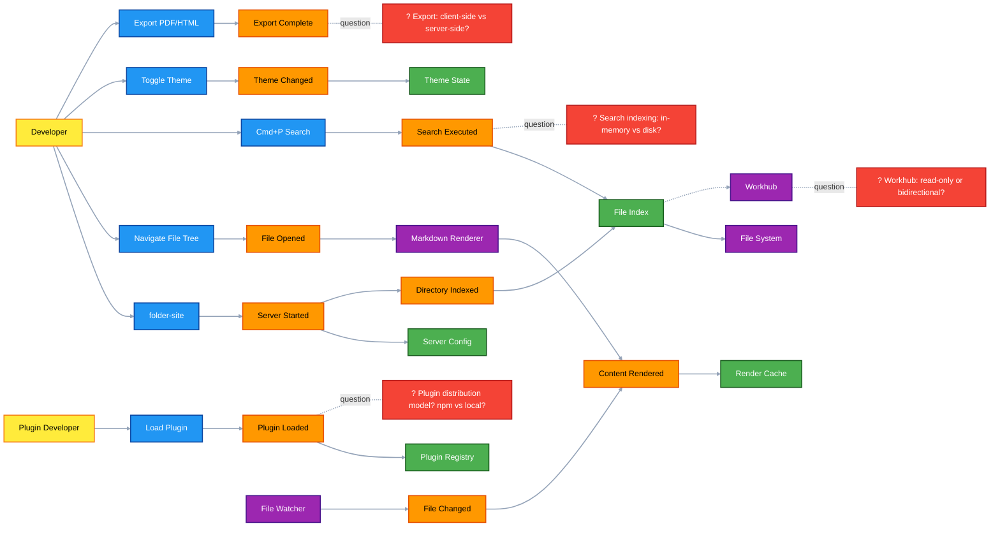
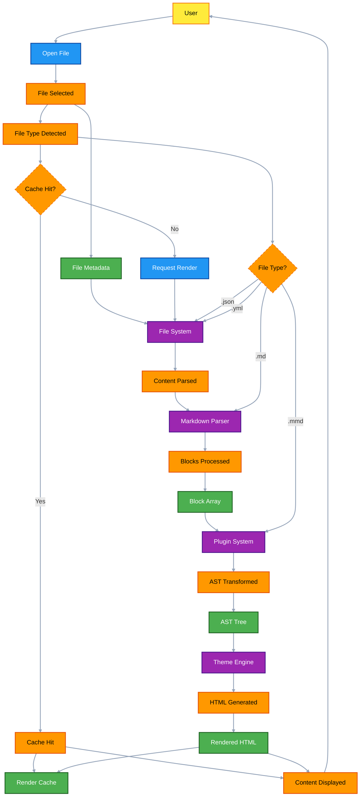
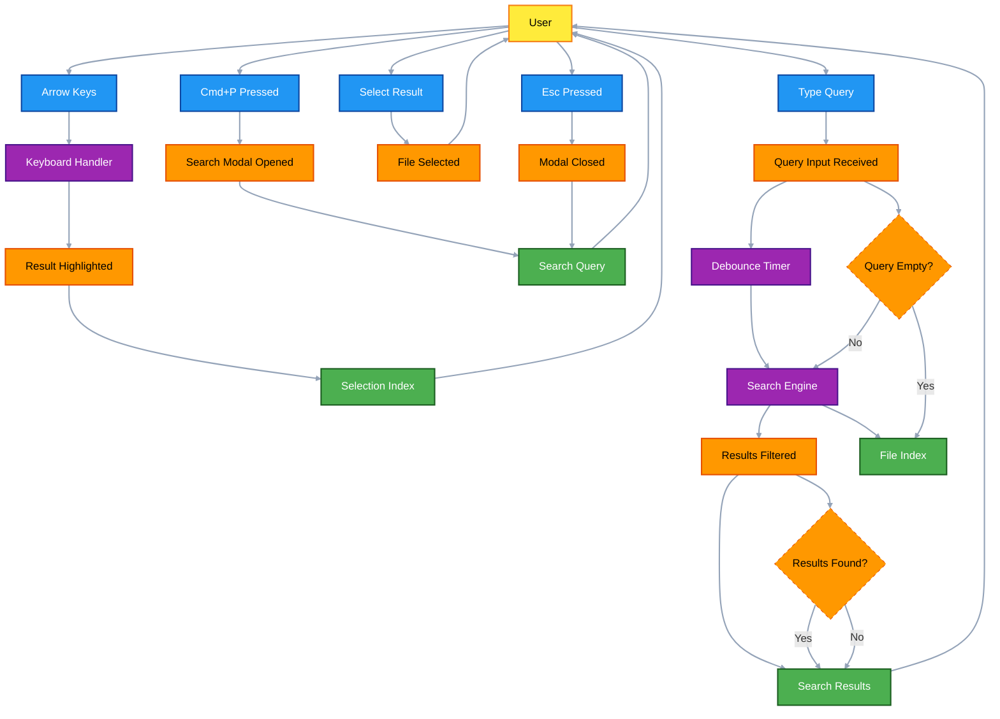
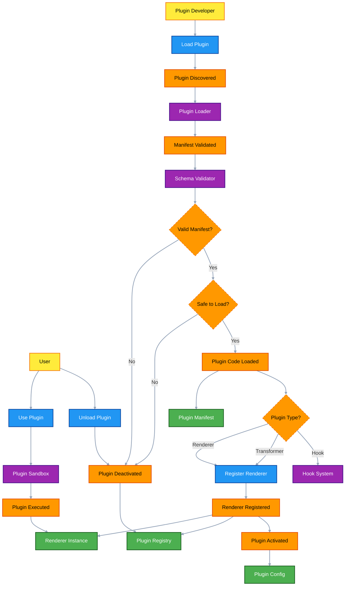
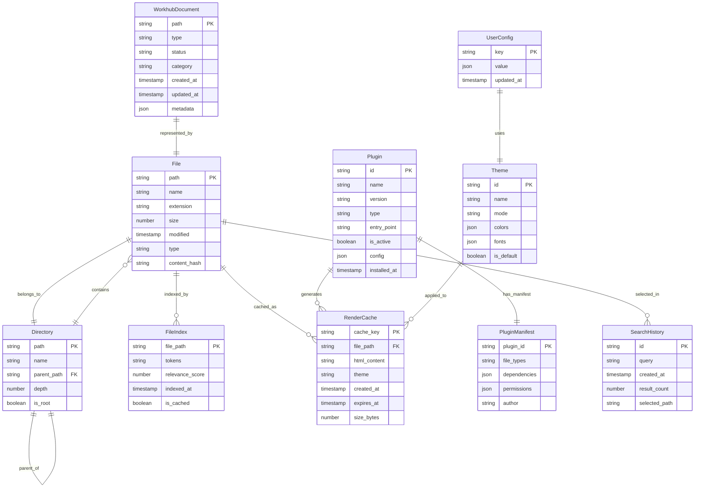
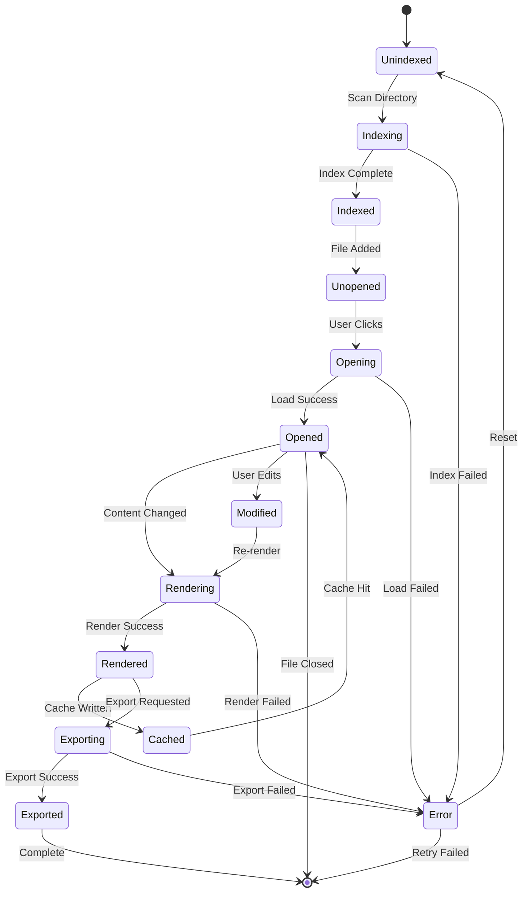
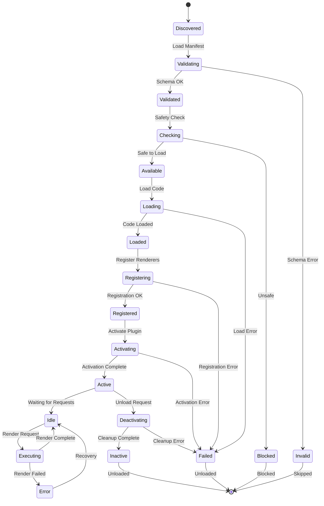
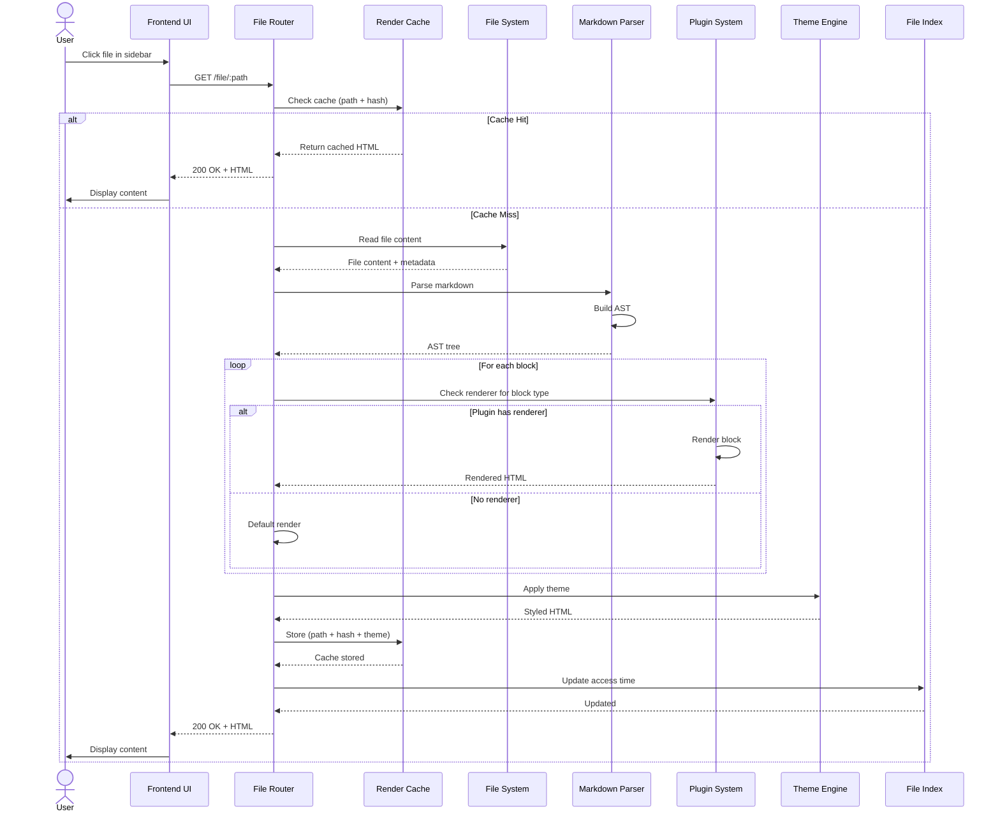
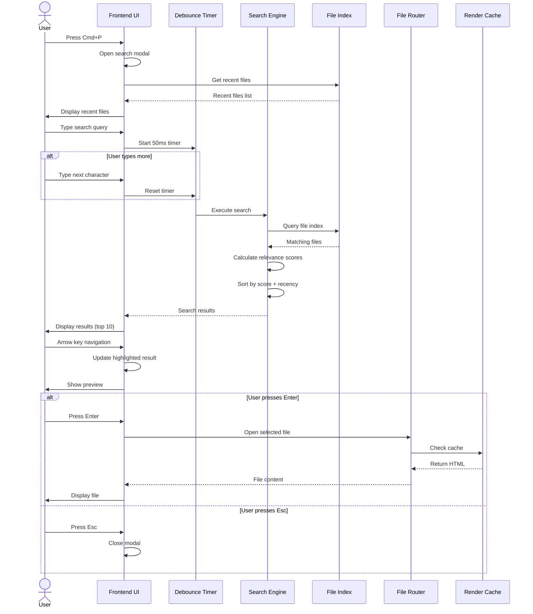

# Folder-Site CLI - Design Catalog

> **System Design through EventStorming**
>
> A CLI tool that converts the current directory into a browsable website with one command, designed for local documentation preview, knowledge base display, and Workhub integration.

---

## 📋 Table of Contents

- [Overview](#overview)
- [Requirements](#requirements)
- [Design System](#design-system)
- [Big Picture (EventStorming)](#big-picture-eventstorming)
- [Process Flows](#process-flows)
- [Data Model](#data-model)
- [Sequence Diagrams](#sequence-diagrams)
- [Hotspots & Decisions](#hotspots--decisions)
- [Next Steps](#next-steps)

---

## Overview

**Project:** Folder-Site CLI
**Goal:** One-command local website generator for documentation and knowledge bases
**Stack:** Bun + Hono + React + Tailwind CSS + Radix UI + shadcn/ui
**Pattern:** VS Code-like interface with plugin architecture

> 📦 **Tech Stack Details:** See [tech-stack.md](./tech-stack.md) for complete component library selection

### Key Features

- ✅ Single command execution (`folder-site`)
- ✅ Directory tree navigation (VS Code sidebar)
- ✅ Markdown rendering with syntax highlighting
- ✅ Real-time preview (auto-refresh)
- ✅ Quick search (Cmd+P style)
- ✅ Plugin system (VS Code Extensions-like)
- ✅ Dark/Light theme toggle
- ✅ Workhub integration

---

## Requirements

### Business Goals

1. **Instant Local Preview** - Transform any directory into a browsable website instantly
2. **Knowledge Base Integration** - Seamlessly integrate with Workhub for docs/ management
3. **Developer Experience** - VS Code-like interface with familiar shortcuts
4. **Extensibility** - Plugin architecture supporting custom renderers

### Supported File Types

| Extension | Type | Renderer |
|-----------|------|----------|
| `.md` | Markdown | Built-in |
| `.mmd` | Mermaid | Plugin |
| `.txt` | Plain Text | Built-in |
| `.json` | JSON | Built-in |
| `.yml` / `.yaml` | YAML | Built-in |

### Non-Functional Requirements

| Category | Requirement |
|----------|-------------|
| **Performance** | Search < 100ms, page load < 500ms |
| **Usability** | VS Code-like, Cmd+P shortcuts |
| **Reliability** | 99% uptime locally |
| **Portability** | Pure local, no network |
| **Startup Time** | < 2 seconds |

---

## Design System

### Pattern: FAQ/Documentation Landing

**Conversion Focus:**
- Reduce support tickets
- Track search analytics
- Show related articles
- Contact escalation path

### Style: Minimalism & Swiss Style

**Keywords:** Clean, simple, spacious, functional, white space, high contrast, geometric, sans-serif, grid-based, essential

### Colors

| Role | Hex | Tailwind |
|------|-----|----------|
| **Primary** | #3B82F6 | `blue-500` |
| **Secondary** | #60A5FA | `blue-400` |
| **CTA** | #F97316 | `orange-500` |
| **Background** | #F8FAFC | `slate-50` |
| **Text** | #1E293B | `slate-800` |

### Typography

- **Headings:** JetBrains Mono (400, 500, 600, 700)
- **Body:** IBM Plex Sans (300, 400, 500, 600, 700)
- **Code:** JetBrains Mono (400, 500)

### Layout Structure

```
┌─────────────────────────────────────────────────────┐
│ Header: Logo | Search (Cmd+P) | Theme Toggle |      │
├──────────┬──────────────────────────────────────────┤
│          │                                          │
│ Sidebar  │         Main Content Area               │
│          │                                          │
│ File     │  ┌────────────────────────────┐         │
│ Tree     │  │                            │         │
│          │  │   Markdown Content         │         │
│ 📁 docs  │  │                            │         │
│   📄 ADR │  │   # Heading                │         │
│   📄 ... │  │                            │         │
│   📄 ... │  │   Content...               │         │
│          │  │                            │         │
│ 📁 src   │  └────────────────────────────┘         │
│   📄 ... │                                          │
│          │                                          │
└──────────┴──────────────────────────────────────────┘
```

---

## Big Picture (EventStorming)



### Legend

| Color | Element Type |
|-------|--------------|
| 🟠 Orange | **Events** - Something that happened |
| 🔵 Blue | **Commands** - User actions |
| 🟡 Yellow | **Actors** - Who initiates actions |
| 🟣 Purple | **Systems** - External integrations |
| 🟢 Green | **Aggregates** - Data entities |
| 🔴 Red | **Hotspots** - Questions/Decisions needed |

---

## Process Flows

### 1. File Rendering Pipeline



### 2. Quick Search (Cmd+P)



### 3. Plugin System Lifecycle



---

## Data Model

### Entity-Relationship Diagram



### State Charts

#### File Lifecycle



#### Plugin Lifecycle



---

## Sequence Diagrams

### Open File Flow



### Quick Search Flow



---

## Hotspots & Decisions

### 🔴 Hotspot 1: Plugin Distribution Model

**Question:** How should plugins be distributed?

| Option | Pros | Cons |
|--------|------|------|
| **npm Packages** | Easy discovery, version management | Network required, dependency issues |
| **Local Modules** | Offline capable, no conflicts | Manual installation |
| **Hybrid** | Best of both worlds | More complex |

**Recommendation:** Hybrid model - npm for public plugins, local for custom/private plugins.

---

### 🔴 Hotspot 2: Search Indexing Strategy

**Question:** Should search index be in-memory or disk-based?

| Option | Pros | Cons |
|--------|------|------|
| **In-Memory** | Fast, simple | Lost on restart |
| **Disk-Based** | Persistent | Slower |
| **Hybrid** | Fast + persistent | More complex |

**Recommendation:** Hybrid - In-memory index with periodic disk sync (every 5 min).

---

### 🔴 Hotspot 3: Export Implementation

**Question:** Should export be client-side or server-side?

| Option | Pros | Cons |
|--------|------|------|
| **Client-side** | No server load, pure local | Limited features |
| **Server-side** | Full features | More complex |
| **Hybrid** | Simple + advanced options | More complex |

**Recommendation:** Client-side for basic exports (jsPDF), server-side for advanced (Puppeteer).

---

### 🔴 Hotspot 4: Workhub Integration

**Question:** Should Workhub be read-only or bidirectional?

| Option | Pros | Cons |
|--------|------|------|
| **Read-only** | Simple, safe | Limited functionality |
| **Bidirectional** | Full control | Complex, risky |

**Recommendation:** Start with read-only, add write support with explicit user confirmation.

---

## Next Steps

### Immediate Actions

1. **Choose Hotspot Decisions** - Review and confirm the 4 hotspots above
2. **Technical Stack Validation** - Verify Bun + Hono + React + Tailwind CSS
3. **Prototype Development** - Build MVP with core features

### Implementation Phases

#### Phase 1: Core MVP (Week 1-2)
- ✅ CLI entry point
- ✅ File system scanning
- ✅ Basic Markdown rendering
- ✅ File tree sidebar
- ✅ Dark/Light theme

#### Phase 2: Advanced Features (Week 3-4)
- ✅ Quick search (Cmd+P)
- ✅ Render caching
- ✅ File watching
- ✅ Code highlighting

#### Phase 3: Plugin System (Week 5-6)
- ✅ Plugin architecture
- ✅ Built-in renderers (Mermaid, Graphviz)
- ✅ Plugin manifest schema
- ✅ Security sandboxing

#### Phase 4: Workhub Integration (Week 7-8)
- ✅ docs/ structure parsing
- ✅ ADR/Issue/PR display
- ✅ Workhub-specific UI

#### Phase 5: Polish & Export (Week 9-10)
- ✅ Export to PDF/HTML
- ✅ Performance optimization
- ✅ Error handling
- ✅ Documentation

---

## 🛠️ Tech Stack Quick Reference

| Layer | Technology | Purpose |
|-------|-----------|---------|
| **Runtime** | Bun | Fast JavaScript runtime |
| **Server** | Hono | Lightweight web framework |
| **Frontend** | React + Vite | Component library & bundler |
| **Styling** | Tailwind CSS | Utility-first CSS |
| **UI Components** | Radix UI + shadcn/ui | Accessible, styled components |
| **File Icons** | @react-symbols/icons | VS Code-style file/folder icons |
| **UI Icons** | RemixIcon | General-purpose icons |
| **Markdown** | unified + remark + rehype | Markdown processing |
| **Syntax Highlight** | rehype-highlight + Shiki | Code highlighting |
| **File Watching** | chokidar | Efficient file watcher |
| **Caching** | lru-cache | LRU cache implementation |
| **Search** | tiny-searcher | Fuzzy search algorithm |
| **PDF Export** | jsPDF | Client-side PDF generation |
| **HTML Export** | html-to-pdfmake | HTML to PDF conversion |

### Component Library Details

#### shadcn/ui Components (Used)
- `Dialog` - Cmd+P search modal
- `DropdownMenu` - Context menus
- `ScrollArea` - Custom scrollbars
- `Separator` - Visual dividers
- `Switch` - Theme toggle
- `Tooltip` - Hover tooltips
- `Command` - Command palette (alternative to Dialog)
- `Resizable` - Resizable sidebar

#### Radix UI Primitives (Underlying)
- `@radix-ui/react-dialog`
- `@radix-ui/react-dropdown-menu`
- `@radix-ui/react-scroll-area`
- `@radix-ui/react-separator`
- `@radix-ui/react-switch`
- `@radix-ui/react-tooltip`
- `@radix-ui/react-command`
- `@radix-ui/react-resizable`

### File & Folder Icons

```typescript
import { FileIcon, FolderIcon } from "@react-symbols/icons/utils";

// File icon
<FileIcon fileName="example.ts" width={16} height={16} />

// Folder icon
<FolderIcon folderName="src" width={16} height={16} />

// Auto-assign for special files
<FileIcon fileName="package.json" autoAssign={true} />
```

### General Icons (RemixIcon)

```typescript
import { RiSearchLine, RiFileTextLine, RiMoonLine } from "react-icons/ri";

// Search icon
<RiSearchLine size={20} />

// File icon
<RiFileTextLine size={20} />

// Theme icon
<RiMoonLine size={20} />
```

**📖 Complete details:**
- [tech-stack.md](./tech-stack.md) - Complete component library selection
- [../component-examples.md](../component-examples.md) - Component usage examples

---

## Design Validation Checklist

- [x] Requirements captured
- [x] EventStorming methodology followed
- [x] All diagrams in Mermaid format
- [x] Catalog structure created
- [x] Hotspots identified
- [x] Design system generated
- [x] Stayed at design level (no SQL, deployment)
- [x] Token-efficient (< 35K tokens)

---

**Ready to proceed with implementation planning?** 🚀