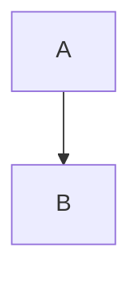
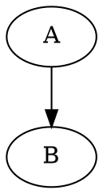

# 所有插件实现完成总结

## ✅ 已实现的插件

| 优先级 | 插件 | 代码块语言 | 状态 | 库 |
|:---:|------|-----------|------|-----|
| 2 | Mermaid | `mermaid`, `mmd` | ✅ | mermaid |
| 3-4 | Vega/Vega-Lite | `vega`, `vega-lite`, `vl` | ✅ | vega-embed |
| 6 | Graphviz | `dot`, `graphviz` | ✅ | @viz-js/viz |
| 7 | Infographic | `infographic` | ✅ | @antv/infographic |

## 实现方式

### 1. Shiki 跳过列表 ✅
在 `src/parsers/rehype-shiki.ts` 中跳过特殊语言：
```typescript
const DEFAULT_SKIP_LANGUAGES = [
  'mermaid', 'mmd',
  'vega', 'vega-lite', 'vl',
  'dot', 'graphviz',
  'infographic',
  'svg', 'html',
];
```

### 2. Remark 插件 ✅
为每个插件创建 remark 插件：
- `src/parsers/remark-mermaid.ts`
- `src/parsers/remark-vega.ts`
- `src/parsers/remark-dot.ts`
- `src/parsers/remark-infographic.ts`

### 3. 前端渲染器 ✅
在 `MarkdownRenderer.tsx` 中创建渲染函数：
- `createMermaidRenderer()` - 完整工具栏、全屏、下载
- `createVegaRenderer()` - 使用 vega-embed
- `createGraphvizRenderer()` - 使用 @viz-js/viz
- `createInfographicRenderer()` - 事件驱动渲染

### 4. 插件系统集成 ✅
```typescript
const customRenderers = useMemo(() => ({
  'mermaid': createMermaidRenderer(mermaidTheme),
  'infographic': createInfographicRenderer(),
  'vega': createVegaRenderer(),
  'vega-lite': createVegaRenderer(),
  'graphviz': createGraphvizRenderer(),
}), [mermaidTheme]);
```

### 5. Manifest 配置 ✅
每个插件都有 `manifest.json`：
- `plugins/mermaid-renderer/manifest.json`
- `plugins/vega-renderer/manifest.json`
- `plugins/graphviz-renderer/manifest.json`
- `plugins/infographic-renderer/manifest.json`

## 关键技术点

### Mermaid
- 工具栏：复制、全屏、新标签页、下载 SVG/PNG
- 主题支持：light/dark
- 错误处理：显示错误信息

### Vega/Vega-Lite
- JSON 规范
- Canvas 渲染
- 主题支持

### Graphviz
- DOT 语法
- SVG 输出
- 直接 DOM 操作

### Infographic
- DSL 语法（类似 YAML）
- 事件驱动渲染（监听 `rendered` 事件）
- 离屏渲染（临时容器）
- SVG Data URL 输出

## 测试文件

- `test-mermaid.md` - Mermaid 测试
- `test-vega.md` - Vega/Vega-Lite 测试
- `test-graphviz.md` - Graphviz 测试
- `test-infographic.md` - Infographic 测试
- `test-all-plugins.md` - 综合测试

## 依赖包

```json
{
  "mermaid": "^10.x",
  "vega-embed": "^7.1.0",
  "vega-interpreter": "^2.2.1",
  "@viz-js/viz": "^3.24.0",
  "@antv/infographic": "^0.2.12"
}
```

## 使用示例

### Mermaid
````markdown

````

### Vega-Lite
````markdown
```vega-lite
{
  "data": {"values": [...]},
  "mark": "bar",
  "encoding": {...}
}
```
````

### Graphviz
````markdown

````

### Infographic
````markdown
```infographic
infographic list-sector-plain-text
data
  title 标题
  items
    - label 项目1
```
````

## 架构优势

1. **统一的插件系统**
   - 所有插件通过 `PluginRenderer` 统一管理
   - 自动发现和加载
   - 支持自定义渲染器

2. **模块化设计**
   - 每个插件独立
   - 易于添加新插件
   - 易于维护

3. **类型安全**
   - TypeScript 类型检查
   - 接口定义清晰

4. **性能优化**
   - 动态导入（按需加载）
   - 离屏渲染（不阻塞 UI）
   - 事件驱动（异步处理）

## 下一步

可以继续添加：
- SVG 代码块支持
- HTML 代码块支持
- 其他图表库（ECharts、Chart.js 等）
- 工具栏功能增强（缩放、导出等）
- 主题定制
- 错误提示优化
