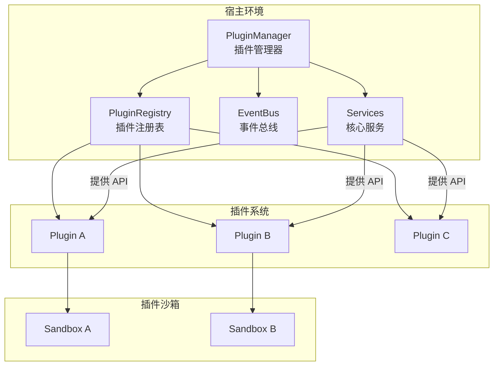
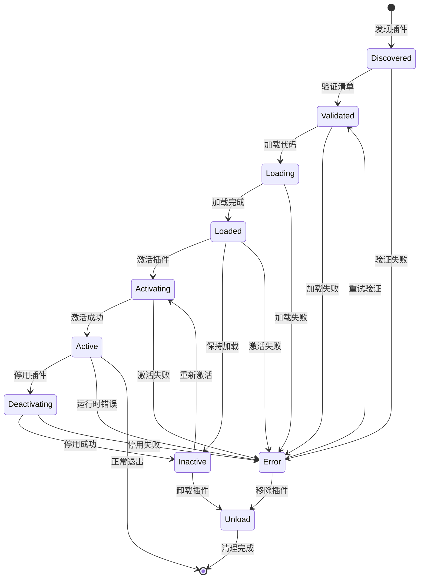

# 插件架构文档

> Folder-Site CLI 插件系统设计文档

## 目录

- [概述](#概述)
- [架构概览](#架构概览)
- [插件清单规范](#插件清单规范)
- [插件生命周期](#插件生命周期)
- [插件 API 参考](#插件-api-参考)
- [插件开发指南](#插件开发指南)
- [示例代码](#示例代码)

---

## 概述

Folder-Site CLI 提供了一个可扩展的插件系统，允许开发者通过插件来扩展应用的功能。插件可以提供：

- **渲染器** (`renderer`) - 提供内容渲染功能，如 Mermaid、Graphviz 等
- **转换器** (`transformer`) - 提供内容转换功能
- **导出器** (`exporter`) - 提供内容导出功能，如 PDF、HTML 导出
- **存储** (`storage`) - 提供数据存储功能
- **UI 扩展** (`ui`) - 提供 UI 组件或扩展

## 架构概览

### 系统架构图



### 核心组件

| 组件 | 职责 |
|------|------|
| `PluginManager` | 管理插件的完整生命周期 |
| `PluginRegistry` | 维护已注册插件的索引 |
| `PluginContext` | 提供插件运行时的上下文环境 |
| `PluginSandbox` | 提供插件运行的沙箱环境 |

---

## 插件清单规范

### 清单文件结构

每个插件必须在其根目录包含一个 `plugin.json` 文件：

```json
{
  "id": "my-plugin",
  "name": "My Plugin",
  "version": "1.0.0",
  "description": "A sample plugin for Folder-Site",
  "author": {
    "name": "Developer Name",
    "email": "developer@example.com",
    "url": "https://example.com"
  },
  "license": "MIT",
  "entry": "./dist/index.js",
  "dependencies": {
    "some-library": "^1.0.0"
  },
  "peerDependencies": {
    "folder-site": ">=0.1.0"
  },
  "capabilities": [
    {
      "type": "renderer",
      "name": "mermaid",
      "version": "1.0.0"
    }
  ],
  "hooks": {
    "onLoad": "onLoad",
    "onActivate": "onActivate",
    "onDeactivate": "onDeactivate",
    "onUnload": "onUnload"
  },
  "options": {
    "type": "object",
    "properties": {
      "enabled": {
        "type": "boolean",
        "description": "Enable the plugin",
        "default": true
      }
    }
  },
  "engines": {
    "node": ">=18.0.0",
    "folder-site": ">=0.1.0"
  }
}
```

### 字段说明

| 字段 | 类型 | 必需 | 描述 |
|------|------|------|------|
| `id` | `string` | ✅ | 插件唯一标识符（反向域名格式） |
| `name` | `string` | ✅ | 插件显示名称 |
| `version` | `string` | ✅ | 语义化版本号 |
| `description` | `string` | ❌ | 插件描述 |
| `author` | `object` | ❌ | 作者信息 |
| `license` | `string` | ❌ | 许可证（SPDX 标识符） |
| `entry` | `string` | ✅ | 插件入口文件路径 |
| `main` | `string` | ❌ | 主模块路径（兼容旧版本） |
| `dependencies` | `object` | ❌ | 插件依赖 |
| `peerDependencies` | `object` | ❌ | 宿主环境依赖 |
| `capabilities` | `array` | ✅ | 能力声明列表 |
| `hooks` | `object` | ❌ | 生命周期钩子配置 |
| `options` | `object` | ❌ | 配置项模式 |
| `engines` | `object` | ❌ | 兼容性要求 |

### 能力类型

```typescript
type PluginCapabilityType = 
  | 'renderer'   // 渲染器能力
  | 'transformer' // 转换器能力
  | 'exporter'   // 导出器能力
  | 'storage'    // 存储能力
  | 'ui'         // UI 能力
  | 'custom';    // 自定义能力
```

---

## 插件生命周期

### 生命周期状态图



### 状态说明

| 状态 | 描述 |
|------|------|
| `discovered` | 插件已被扫描发现，尚未验证 |
| `validated` | 插件清单已验证通过 |
| `loading` | 正在加载插件代码 |
| `loaded` | 插件代码已加载完成 |
| `activating` | 正在激活插件 |
| `active` | 插件已激活并运行 |
| `deactivating` | 正在停用插件 |
| `inactive` | 插件已停用但仍保持加载 |
| `error` | 插件发生错误 |

### 生命周期事件

```typescript
const PluginLifecycleEvent = {
  Discover: 'plugin:discover',    // 发现插件
  Validate: 'plugin:validate',    // 验证插件
  Load: 'plugin:load',           // 加载插件
  Unload: 'plugin:unload',       // 卸载插件
  Activate: 'plugin:activate',   // 激活插件
  Deactivate: 'plugin:deactivate', // 停用插件
  Error: 'plugin:error',         // 插件错误
} as const;
```

---

## 插件 API 参考

### Plugin 接口

```typescript
interface Plugin {
  /** 插件唯一标识符（只读） */
  readonly id: string;
  
  /** 插件名称（只读） */
  readonly name: string;
  
  /** 插件版本（只读） */
  readonly version: string;
  
  /** 插件清单（只读） */
  readonly manifest: PluginManifest;
  
  /** 插件状态（只读） */
  readonly status: PluginStatus;
  
  /** 插件错误（只读，可选） */
  readonly error?: Error;
  
  /** 初始化插件（宿主环境调用） */
  initialize(context: PluginContext): Promise<void>;
  
  /** 激活插件 */
  activate(): Promise<void>;
  
  /** 停用插件 */
  deactivate(): Promise<void>;
  
  /** 销毁插件（清理资源） */
  dispose(): Promise<void>;
}
```

### PluginContext 接口

```typescript
interface PluginContext {
  /** 宿主环境信息 */
  readonly app: {
    readonly version: string;           // Folder-Site 版本
    readonly environment: 'development' | 'production';
    readonly rootPath: string;          // 项目根路径
    readonly configPath: string;        // 配置文件路径
  };
  
  /** 服务访问 */
  readonly services: {
    readonly fileService: FileService;
    readonly indexService: IndexService;
    readonly transformService: TransformService;
    readonly renderService: RenderService;
    readonly exportService: ExportService;
  };
  
  /** 事件系统 */
  readonly events: PluginEventEmitter;
  
  /** 日志系统 */
  readonly logger: PluginLogger;
  
  /** 插件存储 */
  readonly storage: PluginStorage;
  
  /** 工具函数 */
  readonly utils: PluginUtils;
  
  /** 配置 */
  readonly config: PluginConfig;
}
```

### PluginEventEmitter 接口

```typescript
interface PluginEventEmitter {
  /** 订阅事件 */
  on<T = unknown>(event: string, handler: (data: T) => void): Disposable;
  
  /** 订阅事件（一次性） */
  once<T = unknown>(event: string, handler: (data: T) => void): Disposable;
  
  /** 发布事件 */
  emit<T = unknown>(event: string, data: T): void;
  
  /** 取消订阅 */
  off(event: string, handler: (data: unknown) => void): void;
}
```

### PluginStorage 接口

```typescript
interface PluginStorage {
  /** 获取存储值 */
  get<T = unknown>(key: string, defaultValue?: T): T | undefined;
  
  /** 设置存储值 */
  set<T = unknown>(key: string, value: T): void;
  
  /** 删除存储值 */
  remove(key: string): void;
  
  /** 清空存储 */
  clear(): void;
  
  /** 检查键是否存在 */
  has(key: string): boolean;
  
  /** 获取所有键 */
  keys(): string[];
}
```

### PluginLogger 接口

```typescript
interface PluginLogger {
  /** 调试日志 */
  debug(message: string, ...args: unknown[]): void;
  
  /** 信息日志 */
  info(message: string, ...args: unknown[]): void;
  
  /** 警告日志 */
  warn(message: string, ...args: unknown[]): void;
  
  /** 错误日志 */
  error(message: string, ...args: unknown[]): void;
}
```

---

## 插件开发指南

### 快速开始

#### 1. 创建插件目录结构

```
my-plugin/
├── plugin.json          # 插件清单
├── package.json         # npm 配置（可选）
├── src/
│   └── index.ts         # 入口文件
├── dist/
│   └── index.js         # 构建产物
└── README.md            # 插件文档
```

#### 2. 编写插件清单

```json
{
  "id": "my-renderer",
  "name": "My Renderer",
  "version": "1.0.0",
  "description": "A custom markdown renderer",
  "entry": "./dist/index.js",
  "capabilities": [
    {
      "type": "renderer",
      "name": "my-renderer",
      "version": "1.0.0"
    }
  ]
}
```

#### 3. 实现插件类

```typescript
// src/index.ts
import type { Plugin, PluginContext } from '@types/plugin.js';

export default class MyRendererPlugin implements Plugin {
  readonly id = 'my-renderer';
  readonly name = 'My Renderer';
  readonly version = '1.0.0';
  
  private context?: PluginContext;
  private enabled = true;

  constructor(manifest: { capabilities: Array<{ type: string; name: string }> }) {
    // 可以从清单中读取配置
  }

  async initialize(context: PluginContext): Promise<void> {
    this.context = context;
    this.context.logger.info('My Renderer plugin initialized');
  }

  async activate(): Promise<void> {
    if (!this.context) {
      throw new Error('Plugin not initialized');
    }
    
    this.enabled = true;
    
    // 注册渲染器
    this.context.events.emit('renderer:register', {
      type: 'my-renderer',
      render: this.render.bind(this),
    });
    
    this.context.logger.info('My Renderer plugin activated');
  }

  async deactivate(): Promise<void> {
    this.enabled = false;
    
    // 注销渲染器
    this.context?.events.emit('renderer:unregister', {
      type: 'my-renderer',
    });
    
    this.context?.logger.info('My Renderer plugin deactivated');
  }

  async dispose(): Promise<void> {
    this.context = undefined;
  }

  private render(content: string): string {
    // 渲染逻辑
    return `<div class="my-renderer">${content}</div>`;
  }
}
```

### 最佳实践

#### 1. 错误处理

```typescript
async activate(): Promise<void> {
  try {
    // 激活逻辑
  } catch (error) {
    this.context?.logger.error('Activation failed', error);
    throw error;
  }
}
```

#### 2. 资源清理

```typescript
async dispose(): Promise<void> {
  // 清理定时器
  if (this.timer) {
    clearInterval(this.timer);
  }
  
  // 移除事件监听器
  this.disposables.forEach((d) => d.dispose());
  this.disposables.clear();
  
  // 关闭连接
  await this.connection?.close();
}
```

#### 3. 配置管理

```typescript
// 读取配置
const enabled = this.context?.config.get<boolean>('enabled', true);

// 监听配置变化
this.context?.config.onChange('enabled', (value) => {
  if (value) {
    this.activate();
  } else {
    this.deactivate();
  }
});
```

#### 4. 事件通信

```typescript
// 订阅事件
const disposable = this.context?.events.on('file:changed', (data) => {
  // 处理文件变化
});

// 发布事件
this.context?.events.emit('my-plugin:ready', { timestamp: Date.now() });

// 一次性订阅
this.context?.events.once('app:initialized', () => {
  // 应用初始化完成
});
```

### 完整示例：Mermaid 渲染器插件

```typescript
// src/index.ts
import type { Plugin, PluginContext, PluginManifest } from '@types/plugin.js';

interface MermaidConfig {
  theme?: 'default' | 'dark' | 'neutral';
  width?: number;
  height?: number;
}

export default class MermaidRendererPlugin implements Plugin {
  readonly id = 'mermaid-renderer';
  readonly name = 'Mermaid Renderer';
  readonly version = '1.0.0';
  readonly manifest: PluginManifest;
  
  private context?: PluginContext;
  private config: MermaidConfig = { theme: 'default' };
  private disposables: Array<() => void> = [];

  constructor(manifest: PluginManifest) {
    this.manifest = manifest;
    
    // 读取配置
    if (manifest.options?.properties) {
      const options = manifest.options.properties;
      if (options.theme?.enum) {
        this.config.theme = options.theme.default as 'default' | 'dark' | 'neutral';
      }
    }
  }

  async initialize(context: PluginContext): Promise<void> {
    this.context = context;
    context.logger.info('Mermaid Renderer initialized');
  }

  async activate(): Promise<void> {
    if (!this.context) {
      throw new Error('Plugin not initialized');
    }

    // 加载 Mermaid 库
    await this.loadMermaid();

    // 注册渲染器
    const disposable = this.context.events.on('render:markdown', async (data) => {
      if (data.element?.tagName === 'CODE' && data.element.classList.contains('language-mermaid')) {
        await this.renderMermaid(data.element);
      }
    });
    this.disposables.push(() => disposable.dispose());

    this.context.logger.info('Mermaid Renderer activated');
  }

  async deactivate(): Promise<void> {
    this.disposables.forEach((dispose) => dispose());
    this.disposables.clear();
    this.context?.logger.info('Mermaid Renderer deactivated');
  }

  async dispose(): Promise<void> {
    await this.deactivate();
    this.context = undefined;
  }

  private async loadMermaid(): Promise<void> {
    return new Promise((resolve, reject) => {
      const script = document.createElement('script');
      script.src = 'https://cdn.jsdelivr.net/npm/mermaid/dist/mermaid.min.js';
      script.onload = () => resolve();
      script.onerror = () => reject(new Error('Failed to load Mermaid'));
      document.head.appendChild(script);
    });
  }

  private async renderMermaid(codeElement: HTMLElement): Promise<void> {
    const graphDefinition = codeElement.textContent || '';
    const container = document.createElement('div');
    container.className = 'mermaid';
    container.textContent = graphDefinition;
    
    codeElement.parentElement?.replaceWith(container);

    try {
      // @ts-ignore - Mermaid 可能没有在全局声明
      if (typeof mermaid !== 'undefined') {
        // @ts-ignore
        await mermaid.run({
          nodes: [container],
        });
      }
    } catch (error) {
      this.context?.logger.error('Failed to render mermaid diagram', error);
      container.innerHTML = `<pre class="error">${graphDefinition}</pre>`;
    }
  }
}
```

### 插件清单配置

```json
{
  "id": "mermaid-renderer",
  "name": "Mermaid Renderer",
  "version": "1.0.0",
  "description": "Render mermaid diagrams in markdown",
  "entry": "./dist/index.js",
  "capabilities": [
    {
      "type": "renderer",
      "name": "mermaid",
      "version": "1.0.0"
    }
  ],
  "options": {
    "type": "object",
    "properties": {
      "theme": {
        "type": "string",
        "description": "Mermaid diagram theme",
        "enum": ["default", "dark", "neutral"],
        "default": "default"
      },
      "width": {
        "type": "number",
        "description": "Default diagram width",
        "default": 800
      },
      "height": {
        "type": "number",
        "description": "Default diagram height",
        "default": 600
      }
    }
  },
  "engines": {
    "folder-site": ">=0.1.0"
  }
}
```

---

## 常见问题

### Q1: 如何调试插件？

使用 `context.logger` 输出调试信息：

```typescript
this.context.logger.debug('Processing file:', filePath);
this.context.logger.info('Plugin activated');
this.context.logger.warn('Fallback to default renderer');
this.context.logger.error('Render failed', error);
```

### Q2: 如何在不同插件间通信？

通过事件系统：

```typescript
// 插件 A 发送消息
this.context.events.emit('plugin-a:message', { data: 'hello' });

// 插件 B 接收消息
this.context.events.on('plugin-a:message', (data) => {
  console.log('Received:', data);
});
```

### Q3: 如何存储插件数据？

使用 `context.storage`：

```typescript
// 保存数据
this.context.storage.set('lastRendered', Date.now());

// 读取数据
const lastRendered = this.context.storage.get<number>('lastRendered');

// 检查是否存在
if (this.context.storage.has('key')) {
  // ...
}
```

### Q4: 插件如何处理配置变化？

```typescript
// 监听配置变化
this.context.config.onChange('settingKey', (newValue) => {
  this.applySetting(newValue);
});

// 读取当前配置
const value = this.context.config.get('settingKey', defaultValue);
```

---

## 版本历史

| 版本 | 日期 | 变更 |
|------|------|------|
| 1.0.0 | 2026-01-22 | 初始版本 |

---

## 相关资源

- [Folder-Site 项目主页](https://github.com/example/folder-site)
- [插件示例仓库](https://github.com/example/folder-site-plugins)
- [问题反馈](https://github.com/example/folder-site/issues)
