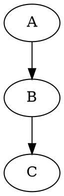

# 插件快速参考

## 支持的代码块类型

| 类型 | 语言标识 | 用途 | 示例 |
|------|---------|------|------|
| Mermaid | `mermaid`, `mmd` | 流程图、时序图、类图 | 流程图、ER图 |
| Vega-Lite | `vega-lite`, `vl` | 数据可视化（简化） | 柱状图、折线图 |
| Vega | `vega` | 数据可视化（完整） | 复杂图表 |
| Graphviz | `dot`, `graphviz` | 图形布局 | 有向图、状态机 |
| Infographic | `infographic` | 信息图设计 | 列表、时间线 |

## 快速示例

### Mermaid 流程图
````markdown

````

### Vega-Lite 图表
````markdown
```vega-lite
{
  "data": {"values": [{"x": "A", "y": 10}]},
  "mark": "bar",
  "encoding": {
    "x": {"field": "x", "type": "nominal"},
    "y": {"field": "y", "type": "quantitative"}
  }
}
```
````

### Graphviz 图
````markdown

````

### Infographic 信息图
````markdown
```infographic
infographic list-sector-plain-text
data
  title 标题
  items
    - label 项目1
      desc 描述1
```
````

## 测试命令

```bash
# 打开测试文件
open http://localhost:3009/test-all-plugins.md

# 或分别测试
open http://localhost:3009/test-mermaid.md
open http://localhost:3009/test-vega.md
open http://localhost:3009/test-graphviz.md
open http://localhost:3009/test-infographic.md
```

## 控制台日志

正常情况下应该看到：
```
[PluginRenderer] Loading plugins...
[PluginRenderer] Loaded plugins: ['mermaid', 'vega', 'vega-lite', 'graphviz', 'infographic']
[PluginRenderer] Using custom renderer for mermaid
[PluginRenderer] Using custom renderer for vega
[PluginRenderer] Using custom renderer for graphviz
[PluginRenderer] Using custom renderer for infographic
```

## 故障排查

### 插件未渲染
1. 检查控制台是否有错误
2. 确认代码块语言标识正确
3. 验证 JSON/DSL 语法正确

### 空白输出
- Infographic: 检查 DSL 语法
- Vega: 检查 JSON 格式
- Graphviz: 检查 DOT 语法

### 类型错误
运行类型检查：
```bash
bun run typecheck
```
