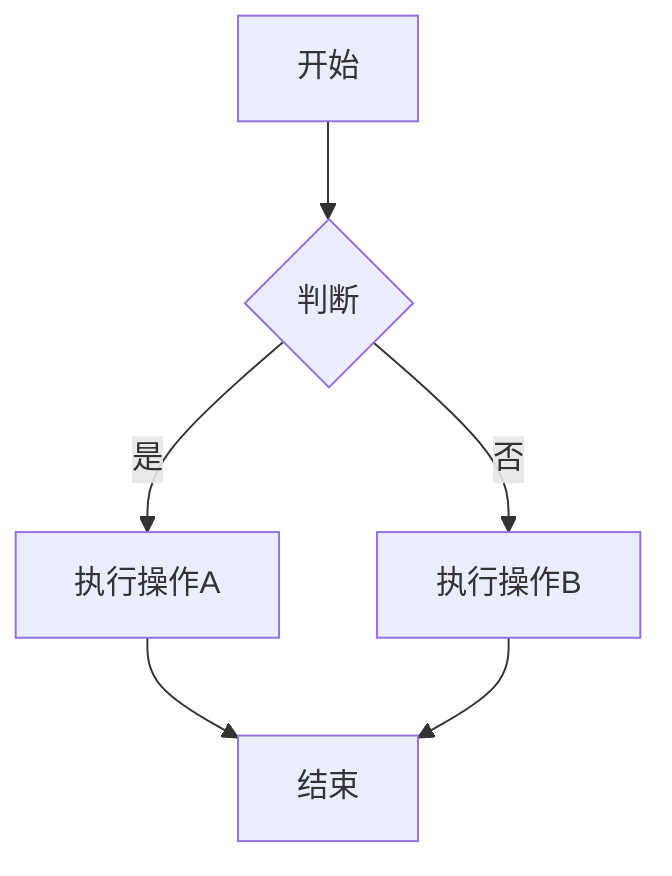
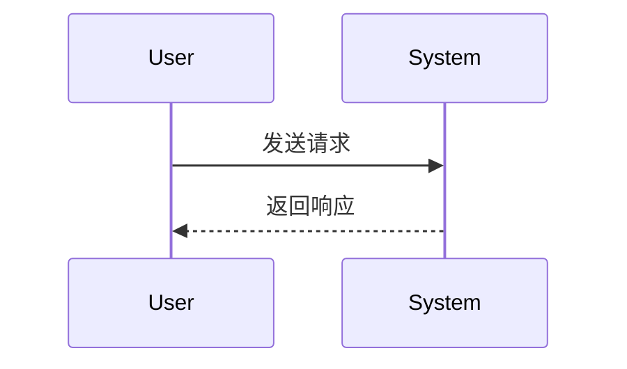
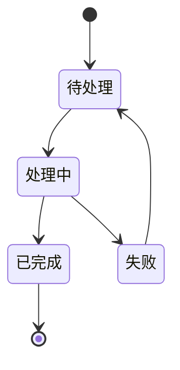
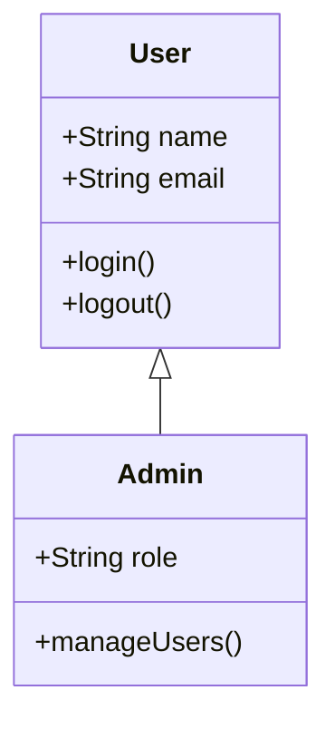
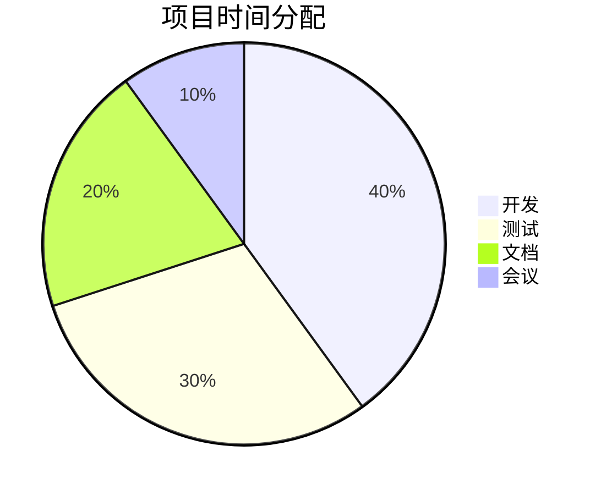

# Mermaid 图表测试

这是一个测试 Mermaid 图表渲染的文档。

## 流程图

```mermaid
flowchart TD
    A[开始] --> B{判断}
    B -->|是| C[执行操作A]
    B -->|否| D[执行操作B]
    C --> E[结束]
    D --> E
```

## 时序图

```mermaid
sequenceDiagram
    participant User
    participant System
    User->>System: 发送请求
    System-->>User: 返回响应
```

## 状态图

```mermaid
stateDiagram-v2
    [*] --> 待处理
    待处理 --> 处理中
    处理中 --> 已完成
    处理中 --> 失败
    失败 --> 待处理
    已完成 --> [*]
```

## 类图

```mermaid
classDiagram
    class User {
        +String name
        +String email
        +login()
        +logout()
    }
    class Admin {
        +String role
        +manageUsers()
    }
    User <|-- Admin
```

## 饼图

```mermaid
pie title 项目时间分配
    "开发" : 40
    "测试" : 30
    "文档" : 20
    "会议" : 10
```