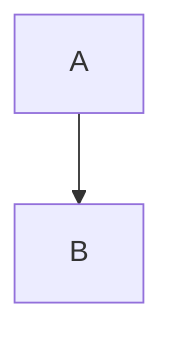

# Mermaid 无法显示 - 问题排查

## 已发现的问题

### 1. 竞态条件 ✅ 已修复
**问题**：`loadPlugins()` 是异步的，但 `renderAll()` 可能在插件加载完成前就被调用。

**修复**：在 `usePluginRenderer` hook 中添加 `pluginsLoaded` 状态，确保插件加载完成后再渲染。

### 2. 调试日志 ✅ 已添加
添加了详细的控制台日志，方便排查问题：
- `[PluginRenderer] Loading plugins...`
- `[PluginRenderer] Fetched manifests: X`
- `[PluginRenderer] Registering plugin: mermaid`
- `[PluginRenderer] Loaded plugins: ['mermaid']`
- `[PluginRenderer] renderAll called`
- `[usePluginRenderer] Initializing renderer...`

## 测试步骤

### 1. 确认服务器运行
```bash
# 检查后端服务器（端口 3008）
curl http://localhost:3008/api/plugins/manifests | jq '.[0].id'
# 应该返回: "mermaid-renderer"

# 检查前端服务器（端口 3009，带代理）
curl http://localhost:3009/api/plugins/manifests | jq '.[0].id'
# 应该返回: "mermaid-renderer"
```

### 2. 访问调试页面
```
http://localhost:3009/debug-plugins.html
```

应该看到完整的插件清单 JSON。

### 3. 打开浏览器控制台
访问任何包含 Mermaid 代码块的页面，检查控制台输出：

**预期输出**：
```
[usePluginRenderer] Initializing renderer...
[usePluginRenderer] Registering custom renderers: ['mermaid']
[PluginRenderer] Loading plugins...
[PluginRenderer] Fetched manifests: 3
[PluginRenderer] Registering plugin: mermaid
[PluginRenderer] Loaded plugins: ['mermaid']
[PluginRenderer] Registered renderers: ['mermaid']
[usePluginRenderer] Plugins loaded successfully
[usePluginRenderer] Rendering plugins...
[PluginRenderer] renderAll called, plugins: ['mermaid']
[PluginRenderer] renderers: ['mermaid']
[PluginRenderer] Processing plugin: mermaid
[PluginRenderer] Using custom renderer for mermaid
```

### 4. 检查 DOM
在浏览器开发者工具中检查：
```javascript
// 检查是否有 mermaid 代码块
document.querySelectorAll('pre.mermaid code')

// 检查是否有渲染后的 wrapper
document.querySelectorAll('.mermaid-wrapper')
```

## 可能的问题

### 问题 A：控制台没有任何日志
**原因**：插件渲染器没有被初始化
**检查**：
1. 确认 `usePluginRenderer` hook 被调用
2. 确认 `customRenderers` 对象正确传递

### 问题 B：日志显示 "Loaded plugins: []"
**原因**：manifest.json 中 `frontend.enabled` 为 false 或不存在
**检查**：
```bash
cat plugins/mermaid-renderer/manifest.json | jq '.capabilities[0].frontend.enabled'
# 应该返回: true
```

### 问题 C：日志显示 "Using default renderer"
**原因**：自定义渲染器没有正确注册
**检查**：
1. 确认 `createMermaidRenderer` 函数存在
2. 确认 `customRenderers` 对象的 key 是 `'mermaid'`（与 manifest 中的 `capability.name` 一致）

### 问题 D：Mermaid 代码块存在但没有渲染
**原因**：代码块的 class 不正确
**检查**：
```javascript
// 应该是 <pre class="mermaid"><code>...</code></pre>
document.querySelectorAll('pre.mermaid')
```

## 下一步调试

如果以上都正常，但 Mermaid 仍然不显示，请：

1. **检查 Mermaid 库是否加载**
   ```javascript
   import('mermaid').then(m => console.log('Mermaid loaded:', m))
   ```

2. **手动测试 Mermaid**
   ```javascript
   const mermaid = (await import('mermaid')).default;
   mermaid.initialize({ startOnLoad: false, theme: 'default' });
   const { svg } = await mermaid.render('test-id', 'graph TD\n  A-->B');
   console.log('SVG:', svg);
   ```

3. **检查 remark-mermaid 插件**
   确认 Markdown 解析器正确添加了 `class="mermaid"` 到代码块。

## 快速测试命令

```bash
# 在项目根目录执行
cd /Users/dengwenyu/Dev/AI/folder-site

# 1. 测试 API
curl -s http://localhost:3009/api/plugins/manifests | jq '.[0].capabilities[0].frontend'

# 2. 创建测试文件
cat > test-mermaid.md << 'EOF'
# Test


EOF

# 3. 在浏览器中打开
open http://localhost:3009/debug-plugins.html
```
