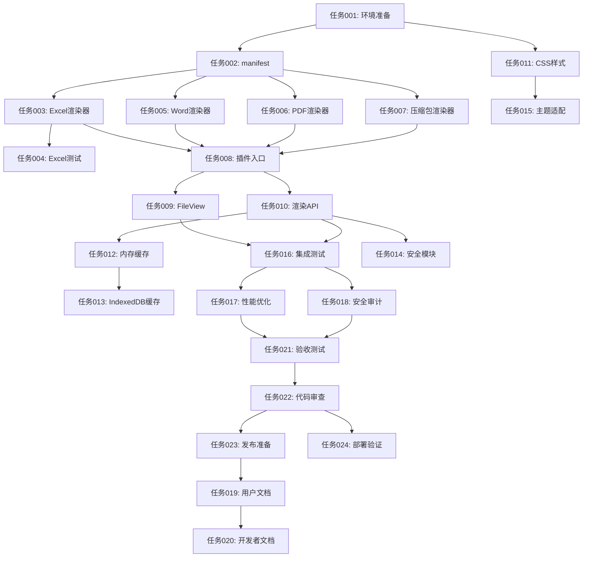

# Office 集成任务列表

## 📋 总览

| 总任务数 | 预估总耗时 | 核心任务 | 第一阶段 | 第二阶段 |
|---------|-----------|---------|---------|---------|
| 24 | 48 小时 | 15 | 11 | 13 |

---

## 🚀 完整任务列表

### Phase 1: 基础框架 (任务001-011)

| ID | 任务标题 | 描述 | 优先级 | 预估 |
|----|---------|------|-------|------|
| 任务001 | 环境准备和依赖安装 | 阅读方案文档，创建插件目录结构，安装必需依赖 | High | 2h |
| 任务002 | 创建插件清单文件 | 编写 manifest.json，声明 excel/word/pdf 渲染器能力 | High | 1h |
| 任务003 | 实现 ExcelRenderer 类 | 使用 SheetJS 实现 Excel 文件解析和 HTML 表格渲染 | High | 4h |
| 任务004 | 实现 ExcelRenderer 测试 | 编写单元测试和性能测试 | Medium | 2h |
| 任务005 | 实现 WordRenderer 类 | 使用 docx-preview 实现 Word 文档渲染 | Medium | 3h |
| 任务006 | 实现 PDFRenderer 类 | 使用 pdf.js 实现 PDF 分页渲染 | Medium | 4h |
| 任务007 | 实现 ArchiveRenderer 类 | 使用 adm-zip 实现压缩包内容浏览 | Low | 2h |
| 任务008 | 创建插件入口 index.ts | 实现插件生命周期和渲染器注册逻辑 | High | 2h |
| 任务009 | 更新 FileView 组件 | 集成渲染器路由，根据文件扩展名选择渲染器 | High | 3h |
| 任务010 | 实现后端渲染 API | 创建 /api/render/office 端点，处理渲染请求 | High | 3h |
| 任务011 | 添加 Office 样式文件 | 创建 office.css，支持亮色/暗色主题 | Medium | 2h |

**Phase 1 小计**: 11 个任务 | 预估耗时: 28 小时

---

### Phase 2: 缓存和安全 (任务012-015)

| ID | 任务标题 | 描述 | 优先级 | 预估 |
|----|---------|------|-------|------|
| 任务012 | 实现内存渲染缓存 | LRU 缓存机制，最大 100MB | Medium | 2h |
| 任务013 | 实现 IndexedDB 持久化缓存 | 浏览器端缓存，7天过期 | Medium | 2h |
| 任务014 | 添加安全验证模块 | 文件类型验证、魔数检查、XSS 防护 | High | 2h |
| 任务015 | 实现文档样式主题适配 | CSS 变量注入和主题切换 | Medium | 1h |

**Phase 2 小计**: 4 个任务 | 预估耗时: 7 小时

---

### Phase 3: 测试和优化 (任务016-018)

| ID | 任务标题 | 描述 | 优先级 | 预估 |
|----|---------|------|-------|------|
| 任务016 | 编写集成测试 | 端到端测试和各种格式文件渲染测试 | Medium | 4h |
| 任务017 | 性能优化 | 懒加载渲染器、虚拟滚动大表格、Web Worker 优化 | Low | 3h |
| 任务018 | 安全审计 | XSS 安全测试、文件上传安全验证 | High | 2h |

**Phase 3 小计**: 3 个任务 | 预估耗时: 9 小时

---

### Phase 4: 文档和发布 (任务019-024)

| ID | 任务标题 | 描述 | 优先级 | 预估 |
|----|---------|------|-------|------|
| 任务019 | 编写用户文档 | Office 渲染器使用指南和 API 文档 | Medium | 2h |
| 任务020 | 编写开发者文档 | 插件开发指南和扩展教程 | Medium | 2h |
| 任务021 | 功能验收测试 | 对照 Phase 1-5 验收标准测试 | High | 3h |
| 任务022 | 代码审查和优化 | 代码质量审查、性能分析、重构 | Medium | 2h |
| 任务023 | 版本发布准备 | 更新 package.json、changelog、发布说明 | Medium | 1h |
| 任务024 | 部署和验证 | 构建发布版本、生产环境测试 | High | 2h |

**Phase 4 小计**: 6 个任务 | 预估耗时: 12 小时

---

## 🔗 依赖关系图



---

## 🎯 关键路径（Critical Path）

```
任务001 (环境准备)
  ↓ 2h
任务002 (manifest) ───→ 任务011 (CSS) [可并行]
  ↓ 1h                    ↑ 2h
任务003 (Excel渲染器)     └─────────────────────→ 任务015 (主题适配)
  ↓ 4h                                            ↑ 1h
任务008 (插件入口)
  ↓ 2h
任务009 (FileView) ───→ 任务010 (API) [可并行]
  ↓ 3h                       ↑ 3h
任务016 (集成测试)
  ↓ 4h
任务021 (验收测试)
  ↓ 3h
任务022 (代码审查)
  ↓ 2h
任务023 (发布准备) ───→ 任务024 (部署) [可并行]
  ↓ 1h                     ↑ 2h
任务019 (用户文档)
  ↓ 2h
任务020 (开发者文档)
  ↓ 2h
✅ 完成
```

---

## ⚡ 可并行任务分组

| 批次 | 任务 | 说明 |
|-----|------|------|
| **批次 2** | 任务002 + 任务011 | 两者都依赖任务001，可并行 |
| **批次 3** | 任务003 + 任务005 + 任务006 + 任务007 + 任务015 | 4个渲染器可并行开发 |
| **批次 5** | 任务009 + 任务010 | 前端和后端可并行 |
| **批次 6** | 任务012 + 任务014 + 任务016 | 缓存、安全、测试可并行 |
| **批次 9** | 任务023 + 任务024 | 发布和部署可并行 |

---

## 📊 优先级分布

| 优先级 | 任务数 | 占比 | 任务ID |
|-------|-------|------|-------|
| **High** | 9 | 37.5% | 001, 002, 003, 008, 009, 010, 014, 018, 021, 024 |
| **Medium** | 12 | 50% | 004, 005, 006, 011, 012, 013, 014, 015, 016, 019, 020, 022 |
| **Low** | 3 | 12.5% | 007, 017 |

---

## 🔧 技术栈概览

| 功能 | 技术库 | 任务 |
|-----|-------|------|
| Excel 解析 | SheetJS (xlsx) | 003 |
| Excel 渲染 | x-spreadsheet | 003 |
| Word 渲染 | docx-preview | 005 |
| PDF 渲染 | pdf.js | 006 |
| 压缩包 | adm-zip, node-unrar-js | 007 |
| 缓存 | LRU + IndexedDB | 012, 013 |
| 安全 | DOMPurify | 014 |
| 前端 | React + TypeScript | 009 |
| 后端 | Hono | 010 |

---

## ✅ 验收标准

### Phase 1 完成标准
- [ ] 所有渲染器能正确渲染对应格式文件
- [ ] FileView 能根据扩展名选择渲染器
- [ ] 后端 API 响应正常
- [ ] CSS 样式支持亮/暗主题

### Phase 2 完成标准
- [ ] LRU 缓存命中率 > 60%
- [ ] IndexedDB 缓存正确过期
- [ ] 安全验证拦截恶意文件
- [ ] 主题切换实时生效

### Phase 3 完成标准
- [ ] 所有测试通过（单元 + 集成）
- [ ] 性能达标：小文件 <1s，中文件 <3s
- [ ] 安全审计无高危漏洞

### Phase 4 完成标准
- [ ] 文档完整，用户可独立使用
- [ ] 代码审查通过，无明显问题
- [ ] 生产环境部署成功

---

**文档版本**: 1.0  
**创建日期**: 2026-01-23  
**最后更新**: 2026-01-23
