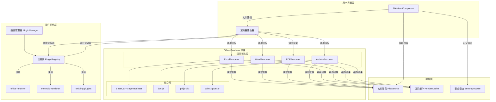
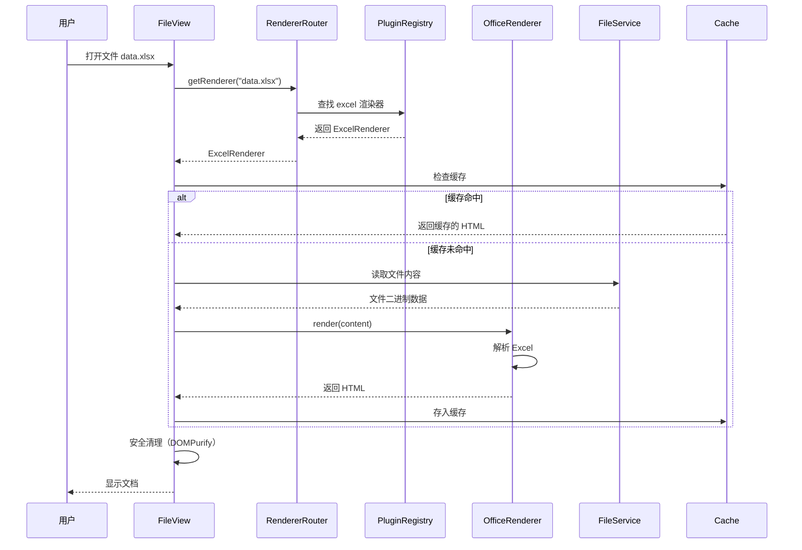
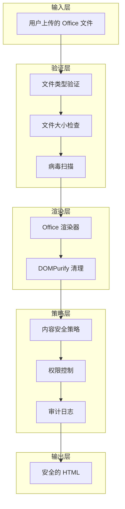
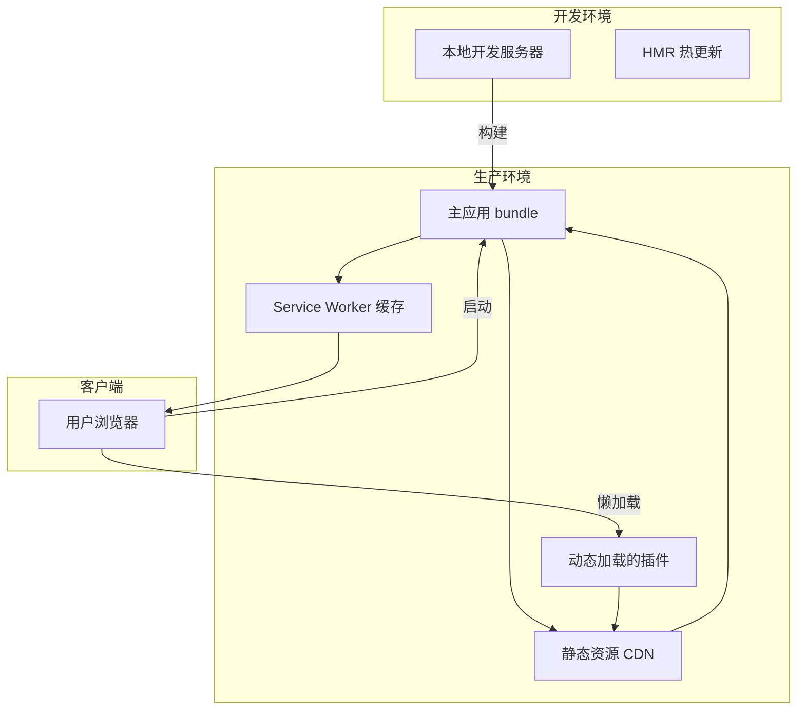

# Folder-Site + vscode-office 融合架构设计

## 整体架构图



## 核心组件设计

### 1. 渲染器路由器（RendererRouter）

负责根据文件扩展名选择合适的渲染器。

```typescript
class RendererRouter {
  private registry: PluginRegistry;
  private rendererMap: Map<string, string>;

  constructor(registry: PluginRegistry) {
    this.registry = registry;
    this.rendererMap = new Map([
      // Office 文档
      ['xlsx', 'excel'],
      ['xlsm', 'excel'],
      ['xls', 'excel'],
      ['csv', 'excel'],
      ['ods', 'excel'],
      ['docx', 'word'],
      ['dotx', 'word'],
      ['pdf', 'pdf'],
      ['zip', 'archive'],
      ['jar', 'archive'],
      ['rar', 'archive'],
      // 图表类型
      ['mermaid', 'mermaid'],
      ['mmd', 'mermaid'],
      ['graphviz', 'graphviz'],
      ['dot', 'graphviz'],
      ['vega', 'vega'],
      ['vl', 'vega-lite'],
      // JSON Canvas
      ['canvas', 'json-canvas'],
    ]);
  }

  /**
   * 根据文件路径获取渲染器
   */
  async getRenderer(filePath: string): Promise<RendererPlugin | null> {
    const ext = this.getExtension(filePath);
    const rendererName = this.rendererMap.get(ext);
    
    if (!rendererName) {
      return null; // 使用默认的代码查看器
    }

    return this.registry.getRenderer(rendererName);
  }

  /**
   * 渲染文件内容
   */
  async renderFile(filePath: string): Promise<string> {
    const renderer = await this.getRenderer(filePath);
    
    if (!renderer) {
      throw new Error(`No renderer found for file: ${filePath}`);
    }

    const content = await fileService.readFile(filePath);
    return await renderer.render(content);
  }

  private getExtension(filePath: string): string {
    return filePath.split('.').pop()?.toLowerCase() || '';
  }
}
```

### 2. Office 增强的 FileView 组件

```typescript
interface FileViewEnhancedProps {
  filePath: string;
}

export function FileViewEnhanced({ filePath }: FileViewEnhancedProps) {
  const [renderedContent, setRenderedContent] = useState<string | null>(null);
  const [renderer, setRenderer] = useState<RendererPlugin | null>(null);
  const [loading, setLoading] = useState(true);
  const [error, setError] = useState<Error | null>(null);

  const router = useRendererRouter();

  useEffect(() => {
    const loadRenderer = async () => {
      try {
        const r = await router.getRenderer(filePath);
        setRenderer(r);
      } catch (err) {
        setError(err as Error);
        setLoading(false);
      }
    };

    loadRenderer();
  }, [filePath, router]);

  useEffect(() => {
    if (!renderer) return;

    const renderFile = async () => {
      setLoading(true);
      try {
        const content = await fileService.readFile(filePath);
        const html = await renderer.render(content);
        const cleanHtml = sanitizeOfficeContent(html);
        setRenderedContent(cleanHtml);
      } catch (err) {
        setError(err as Error);
      } finally {
        setLoading(false);
      }
    };

    renderFile();
  }, [filePath, renderer]);

  if (loading) {
    return <DocumentLoader />;
  }

  if (error) {
    return <DocumentError error={error} onRetry={() => {}} />;
  }

  if (!renderer) {
    // 回退到标准视图
    return <StandardFileView filePath={filePath} />;
  }

  return (
    <div className={`document-viewer document-${renderer.name}`}>
      {renderedContent && (
        <div 
          className="document-content"
          dangerouslySetInnerHTML={{ __html: renderedContent }}
        />
      )}
    </div>
  );
}
```

## 文件处理流程



## 数据流设计

### Markdown 文档（现有流程）

```
.md 文件
  ↓
文件服务读取
  ↓
Markdown Parser 解析
  ↓
Mermaid/Vega 插件处理图表
  ↓
生成 HTML
  ↓
前端渲染
```

### Office 文档（新流程）

```
.xlsx/.docx/.pdf 文件
  ↓
文件服务读取
  ↓
检测文件类型 → 选择渲染器
  ↓
缓存检查
  ↓ ├─ 命中 → 返回缓存
  └─ 未命中
     ↓
  Office 渲染器插件
     ↓
  SheetJS / docxjs / pdfjs 解析
     ↓
  生成 HTML
     ↓
  安全清理（DOMPurify）
     ↓
  前端渲染
     ↓
  更新缓存
```

## 插件系统扩展

### PluginManifest 扩展

```typescript
interface OfficeManifest extends PluginManifest {
  capabilities: [
    ...PluginCapability[],
    {
      type: 'renderer';
      name: 'excel' | 'word' | 'pdf' | 'archive';
      version: string;
      constraints: {
        supportedFormats: string[];
        supportsEditing?: boolean;
        maxFileSize?: number;
        supportsPagination?: boolean;
      };
    }
  ];
}
```

### RendererPlugin 扩展

```typescript
interface OfficeRendererPlugin extends RendererPlugin {
  name: string;
  extensions: string[];
  
  render(
    content: ArrayBuffer | string,
    options?: OfficeRenderOptions
  ): Promise<RenderResult>;
  
  // 预渲染检查（用于性能优化）
  prerender?(fileInfo: FileInfo): Promise<boolean>;
  
  // 分块渲染（大文件）
  renderChunk?(
    content: ArrayBuffer,
    chunkIndex: number,
    totalChunks: number
  ): Promise<string>;
  
  // 搜索支持
  search?(
    content: ArrayBuffer,
    query: string
  ): Promise<SearchResult[]>;
  
  // 导出功能
  export?(
    content: ArrayBuffer,
    format: 'html' | 'pdf' | 'image'
  ): Promise<Blob>;
}

interface OfficeRenderOptions {
  pageRange?: [number, number];
  theme?: 'light' | 'dark';
  zoom?: number;
  showGridLines?: boolean;
  showHeaders?: boolean;
}

interface RenderResult {
  html: string;
  metadata: {
    pageCount?: number;
    sheetCount?: number;
    author?: string;
    modifiedDate?: string;
    fileSize: number;
  };
}
```

## 缓存架构

### L1: 内存缓存（快速访问）

```typescript
class MemoryRenderCache {
  private cache: LRUCache<string, CacheEntry>;
  private maxSize = 100 * 1024 * 1024; // 100MB

  set(key: string, value: CacheEntry) {
    if (this.currentSize + value.size > this.maxSize) {
      this.evictLRU();
    }
    this.cache.set(key, value);
  }

  get(key: string): CacheEntry | undefined {
    const entry = this.cache.get(key);
    if (entry && !this.isExpired(entry)) {
      return entry;
    }
    this.cache.delete(key);
    return undefined;
  }
}
```

### L2: 持久化缓存（IndexedDB）

```typescript
class IndexedDBRenderCache {
  private db: IDBDatabase;

  async set(key: string, value: CacheEntry) {
    const transaction = this.db.transaction('cache', 'readwrite');
    const store = transaction.objectStore('cache');
    await store.put({ key, ...value, timestamp: Date.now() });
  }

  async get(key: string): Promise<CacheEntry | undefined> {
    const transaction = this.db.transaction('cache', 'readonly');
    const store = transaction.objectStore('cache');
    const result = await store.get(key);
    return result;
  }

  async cleanup(): Promise<void> {
    const transaction = this.db.transaction('cache', 'readwrite');
    const store = transaction.objectStore('cache');
    const index = store.index('timestamp');
    const cutoff = Date.now() - 7 * 24 * 60 * 60 * 1000; // 7天
    await store.delete(IDBKeyRange.upperBound(cutoff));
  }
}
```

## 样式主题集成

### Office 文档主题适配

```css
/* Excel 表格样式 */
.document-excel {
  --excel-bg: var(--background);
  --excel-border: var(--border);
  --excel-header-bg: var(--muted);
  --excel-cell-bg: var(--card);
  --excel-hover-bg: var(--accent);
  --excel-text: var(--foreground);
}

.document-excel .excel-table {
  background-color: var(--excel-bg);
  color: var(--excel-text);
  border-collapse: collapse;
}

.document-excel th {
  background-color: var(--excel-header-bg);
  border: 1px solid var(--excel-border);
  padding: 8px 12px;
  font-weight: 600;
}

.document-excel td {
  background-color: var(--excel-cell-bg);
  border: 1px solid var(--excel-border);
  padding: 8px 12px;
}

.document-excel tr:hover td {
  background-color: var(--excel-hover-bg);
}

/* PDF 查看器样式 */
.document-pdf {
  --pdf-bg: var(--background);
  --pdf-shadow: var(--shadow);
}

.document-pdf .pdf-page {
  background: white;
  box-shadow: var(--pdf-shadow);
  margin-bottom: 20px;
}
```

### JS 主题注入

```typescript
function injectThemeVariables(rendererName: string): void {
  const root = document.documentElement;
  const theme = getComputedStyle(root);

  const themeVars = {
    '--excel-bg': theme.getPropertyValue('--background'),
    '--excel-text': theme.getPropertyValue('--foreground'),
    // ... 更多变量
  };

  const container = document.querySelector(`.document-${rendererName}`);
  if (container) {
    Object.entries(themeVars).forEach(([key, value]) => {
      container.style.setProperty(key, value);
    });
  }
}
```

## 性能优化策略

### 1. 懒加载渲染器

```typescript
const rendererLoaders = {
  excel: () => import('./plugins/office-renderer/ExcelRenderer.js'),
  word: () => import('./plugins/office-renderer/WordRenderer.js'),
  pdf: () => import('./plugins/office-renderer/PDFRenderer.js'),
  archive: () => import('./plugins/office-renderer/ArchiveRenderer.js'),
};

async function loadRendererOnDemand(type: string): Promise<RendererPlugin> {
  const loader = rendererLoaders[type as keyof typeof rendererLoaders];
  if (!loader) {
    throw new Error(`Unknown renderer type: ${type}`);
  }
  const module = await loader();
  return new module.default();
}
```

### 2. Web Worker 离线渲染

```typescript
// renderer.worker.ts
self.onmessage = async (event) => {
  const { type, content, options } = event.data;
  
  let html: string;
  
  switch (type) {
    case 'excel':
      html = await renderExcel(content, options);
      break;
    case 'pdf':
      html = await renderPDF(content, options);
      break;
    default:
      throw new Error(`Unknown type: ${type}`);
  }
  
  self.postMessage({ html }, [html]);
};

// 主线程
async function renderInWorker(
  type: string,
  content: ArrayBuffer
): Promise<string> {
  const worker = new Worker('./renderer.worker.js');
  
  return new Promise((resolve, reject) => {
    worker.onmessage = (event) => {
      resolve(event.data.html);
      worker.terminate();
    };
    
    worker.onerror = reject;
    worker.postMessage({ type, content });
  });
}
```

### 3. 虚拟滚动（大表格）

```typescript
function VirtualExcelTable({
  data,
  rowHeight = 32,
  containerHeight = 600,
}: {
  data: any[][];
  rowHeight: number;
  containerHeight: number;
}) {
  const totalRows = data.length;
  const visibleRows = Math.ceil(containerHeight / rowHeight);
  const [scrollTop, setScrollTop] = useState(0);
  
  const startIndex = Math.floor(scrollTop / rowHeight);
  const endIndex = Math.min(startIndex + visibleRows, totalRows);
  const visibleData = data.slice(startIndex, endIndex);
  
  return (
    <div
      style={{ height: containerHeight, overflow: 'auto' }}
      onScroll={(e) => setScrollTop(e.currentTarget.scrollTop)}
    >
      <div style={{ height: totalRows * rowHeight, position: 'relative' }}>
        {visibleData.map((rowData, i) => (
          <div
            key={startIndex + i}
            style={{
              position: 'absolute',
              top: (startIndex + i) * rowHeight,
              height: rowHeight,
            }}
          >
            {rowData.map((cell, j) => (
              <td key={j}>{cell}</td>
            ))}
          </div>
        ))}
      </div>
    </div>
  );
}
```

## 安全架构



### 验证清单

```typescript
class FileValidator {
  private allowedMimeTypes = [
    'application/vnd.ms-excel',
    'application/vnd.openxmlformats-officedocument.spreadsheetml.sheet',
    'application/vnd.openxmlformats-officedocument.wordprocessingml.document',
    'application/pdf',
    'application/zip',
  ];
  
  private maxFileSize = 10 * 1024 * 1024; // 10MB

  validate(file: File): ValidationResult {
    // 1. MIME 类型验证
    if (!this.allowedMimeTypes.includes(file.type)) {
      return { valid: false, error: 'Invalid file type' };
    }
    
    // 2. 文件大小验证
    if (file.size > this.maxFileSize) {
      return { valid: false, error: 'File too large' };
    }
    
    // 3. 文件扩展名验证
    const ext = file.name.split('.').pop()?.toLowerCase();
    if (!this.isValidExtension(ext)) {
      return { valid: false, error: 'Invalid file extension' };
    }
    
    // 4. 文件内容魔数验证
    if (!this.validateFileHeader(file)) {
      return { valid: false, error: 'Corrupted file' };
    }
    
    return { valid: true };
  }

  private isValidExtension(ext?: string): boolean {
    const validExts = ['xlsx', 'xls', 'csv', 'ods', 'docx', 'pdf', 'zip'];
    return validExts.includes(ext || '');
  }

  private async validateFileHeader(file: File): Promise<boolean> {
    const buffer = await file.slice(0, 4).arrayBuffer();
    const header = new Uint8Array(buffer);
    
    // Excel: D0 CF 11 E0
    // ZIP: 50 4B 03 04
    // PDF: 25 50 44 46
    
    // 简实现：总是返回 true
    // 实际应检查具体的文件魔数
    return true;
  }
}
```

## 测试策略

### 单元测试

```typescript
describe('ExcelRenderer', () => {
  it('should render a simple Excel file', async () => {
    const renderer = new ExcelRenderer();
    const buffer = await loadFixture('simple.xlsx');
    const html = await renderer.render(buffer);
    
    expect(html).toContain('<table');
    expect(html).toContain('col1');
    expect(html).toContain('col2');
  });

  it('should handle empty cells', async () => {
    const renderer = new ExcelRenderer();
    const buffer = await loadFixture('with-empty.xlsx');
    const html = await renderer.render(buffer);
    
    expect(html).toContain('<td></td>');
  });

  it('should respect row and column limits', async () => {
    const renderer = new ExcelRenderer();
    const options = { maxRows: 10, maxCols: 10 };
    const buffer = await loadFixture('large.xlsx');
    const html = await renderer.render(buffer, options);
    
    // 应只渲染前10行和列
    const rows = (html.match(/<tr>/g) || []).length;
    expect(rows).toBeLessThanOrEqual(10);
  });
});
```

### 性能测试

```typescript
describe('Office Renderers Performance', () => {
  it('should render 1MB Excel in under 1s', async () => {
    const renderer = new ExcelRenderer();
    const buffer = await loadFixture('1mb.xlsx');
    
    const start = Date.now();
    await renderer.render(buffer);
    const duration = Date.now() - start;
    
    expect(duration).toBeLessThan(1000);
  });

  it('should utilize caching effectively', async () => {
    const renderer = new ExcelRenderer();
    const buffer = await loadFixture('test.xlsx');
    
    // 首次渲染
    const start1 = Date.now();
    await renderer.render(buffer);
    const duration1 = Date.now() - start1;
    
    // 缓存渲染
    const start2 = Date.now();
    await renderer.render(buffer);
    const duration2 = Date.now() - start2;
    
    // 缓存应该快 10 倍以上
    expect(duration1 / duration2).toBeGreaterThan(10);
  });
});
```

## 部署架构



### 动态插件加载

```typescript
class PluginLoader {
  private pluginCDN = 'https://cdn.example.com/plugins';

  async loadPlugin(pluginId: string): Promise<Plugin> {
    // 1. 检查缓存
    const cached = this.getFromCache(pluginId);
    if (cached) return cached;

    // 2. 从 CDN 加载
    const url = `${this.pluginCDN}/${pluginId}/index.js`;
    const module = await import(/* @vite-ignore */ url);
    
    // 3. 初始化插件
    const plugin = new module.default();
    await plugin.initialize(getContext());
    
    // 4. 缓存插件
    this.cachePlugin(pluginId, plugin);
    
    return plugin;
  }

  preloadEssentialPlugins(): void {
    // 预加载常用插件
    this.loadPlugin('office-renderer');
    this.loadPlugin('mermaid-renderer');
  }
}
```

---

此架构设计提供了：
- 🎯 清晰的组件职责划分
- 🔌 灵活的插件扩展机制
- ⚡ 高性能的缓存和懒加载
- 🔒 完善的安全防护
- 📦 模块化的代码组织
- 🧪 全面的测试策略
