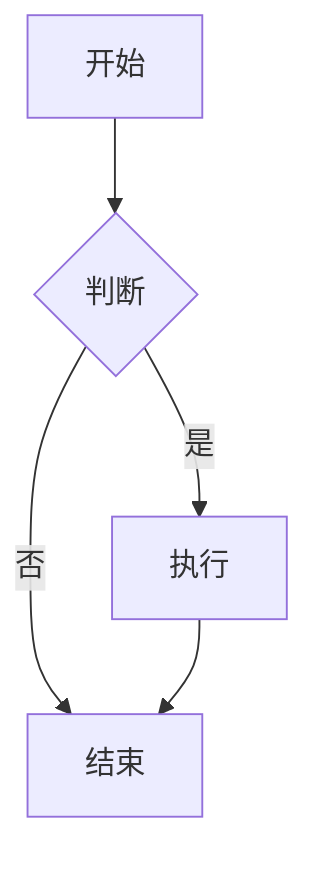
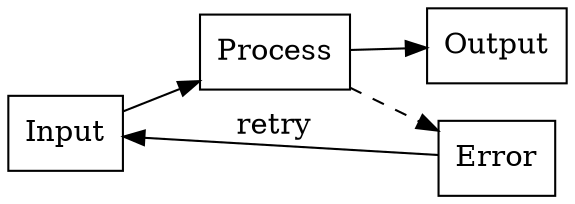

# 所有插件综合测试

## 1. Mermaid 流程图



## 2. Infographic 列表

```infographic
infographic list-sector-plain-text
data
  title 核心功能
  desc 系统主要特性
  items
    - label Markdown 解析
      desc 支持 GFM 和数学公式
    - label 图表渲染
      desc Mermaid、Vega、Graphviz
    - label 文档导出
      desc 支持 PDF 和 DOCX
```

## 3. Vega-Lite 柱状图

```vega-lite
{
  "$schema": "https://vega.github.io/schema/vega-lite/v5.json",
  "data": {
    "values": [
      {"month": "Jan", "sales": 100},
      {"month": "Feb", "sales": 120},
      {"month": "Mar", "sales": 150}
    ]
  },
  "mark": "bar",
  "encoding": {
    "x": {"field": "month", "type": "nominal"},
    "y": {"field": "sales", "type": "quantitative"}
  }
}
```

## 4. Graphviz 流程图



## 5. 代码高亮

```typescript
function hello(name: string): string {
  return `Hello, ${name}!`;
}

console.log(hello('World'));
```

## 6. 数学公式

行内公式：$E = mc^2$

块级公式：
$$
\int_{-\infty}^{\infty} e^{-x^2} dx = \sqrt{\pi}
$$

## 7. 表格

| 插件 | 状态 | 说明 |
|------|------|------|
| Mermaid | ✅ | 流程图、时序图 |
| Infographic | ✅ | 信息图 |
| Vega | ✅ | 数据可视化 |
| Graphviz | ✅ | 图形渲染 |
