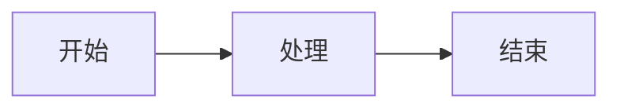
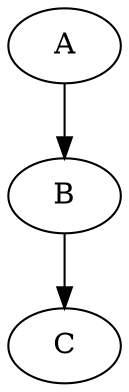

# 完整功能测试

## 1. Mermaid ✅



## 2. Vega-Lite ✅

```vega-lite
{
  "$schema": "https://vega.github.io/schema/vega-lite/v5.json",
  "data": {"values": [{"x": "A", "y": 10}, {"x": "B", "y": 20}]},
  "mark": "bar",
  "encoding": {
    "x": {"field": "x", "type": "nominal"},
    "y": {"field": "y", "type": "quantitative"}
  }
}
```

## 3. Graphviz ✅



## 4. Infographic ✅

```infographic
infographic list-sector-plain-text
data
  title 功能列表
  items
    - label 功能1
    - label 功能2
```

## 5. JSON Canvas 🆕

```json-canvas
{
  "nodes": [
    {"id": "1", "type": "text", "text": "节点1", "x": 50, "y": 50, "width": 100, "height": 60},
    {"id": "2", "type": "text", "text": "节点2", "x": 200, "y": 50, "width": 100, "height": 60}
  ],
  "edges": [{"id": "e1", "fromNode": "1", "toNode": "2"}]
}
```

## 6. SVG 🆕

```svg
<svg width="100" height="100">
  <circle cx="50" cy="50" r="40" fill="blue" />
</svg>
```

## 7. HTML ✅

<div style="background: #f0f0f0; padding: 10px; border-radius: 5px;">
  <strong>HTML 内容</strong>
</div>

## 8. Emoji 🆕

:smile: :heart: :rocket: :fire: :thumbsup:

## 9. LaTeX ✅

行内公式：$E = mc^2$

块级公式：
$$
x = \frac{-b \pm \sqrt{b^2 - 4ac}}{2a}
$$

连分数：
$$
x = a_0 + \cfrac{1}{a_1 + \cfrac{1}{a_2 + \cfrac{1}{a_3}}}
$$

## 10. 代码高亮 ✅

```typescript
function hello(name: string): string {
  return `Hello, ${name}!`;
}
```

## 11. 表格 ✅

| 功能 | 状态 |
|------|------|
| Mermaid | ✅ |
| Vega | ✅ |
| Graphviz | ✅ |

## 12. 任务列表 ✅

- [x] 完成 Mermaid
- [x] 完成 Vega
- [x] 完成 Graphviz
- [x] 完成 Infographic
- [x] 完成 JSON Canvas
- [x] 完成 SVG
- [x] 完成 Emoji
