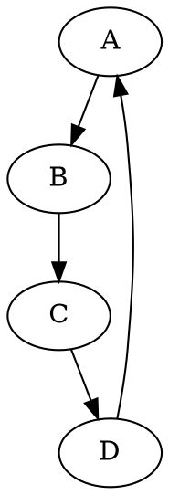
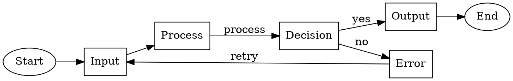
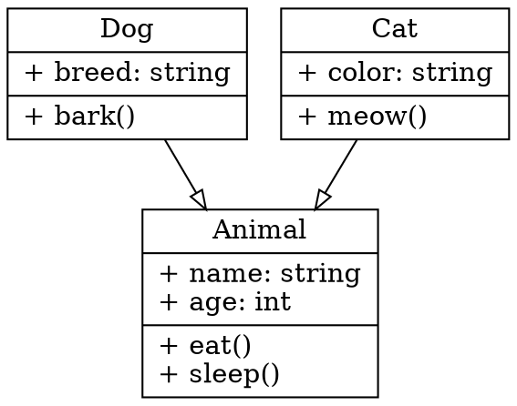
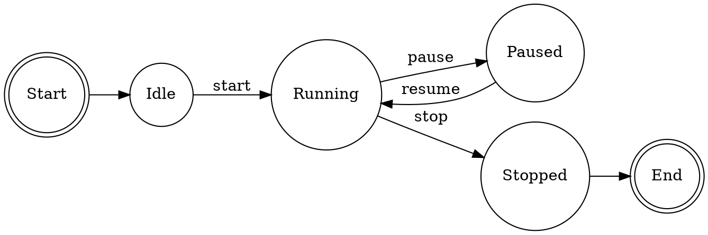

# Graphviz DOT 测试

## 简单有向图

```dot
digraph G {
  A -> B;
  B -> C;
  C -> D;
  D -> A;
}
```

## 流程图

```dot
digraph Process {
  rankdir=LR;
  node [shape=box];
  
  Start [shape=ellipse];
  End [shape=ellipse];
  
  Start -> Input;
  Input -> Process;
  Process -> Decision [label="process"];
  Decision -> Output [label="yes"];
  Decision -> Error [label="no"];
  Output -> End;
  Error -> Input [label="retry"];
}
```

## 类图

```dot
digraph Classes {
  node [shape=record];
  
  Animal [label="{Animal|+ name: string\l+ age: int\l|+ eat()\l+ sleep()\l}"];
  Dog [label="{Dog|+ breed: string\l|+ bark()\l}"];
  Cat [label="{Cat|+ color: string\l|+ meow()\l}"];
  
  Dog -> Animal [arrowhead=empty];
  Cat -> Animal [arrowhead=empty];
}
```

## 状态机

```dot
digraph StateMachine {
  rankdir=LR;
  node [shape=circle];
  
  Start [shape=doublecircle];
  End [shape=doublecircle];
  
  Start -> Idle;
  Idle -> Running [label="start"];
  Running -> Paused [label="pause"];
  Paused -> Running [label="resume"];
  Running -> Stopped [label="stop"];
  Stopped -> End;
}
```
